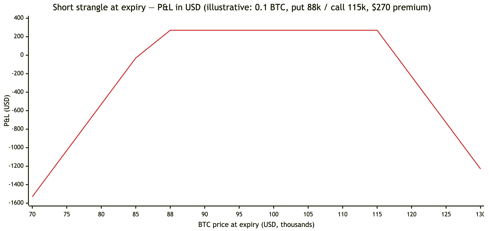

# The strategy, explained

How this bot makes (and loses) money, in plain language. No code knowledge needed. For the technical side, see the [README](README.md).

---

> ## ⚠️ Disclaimer
>
> **This is a study project, not investment advice and not a professional trading tool.**
>
> optionsBot is a personal exercise in Go concurrency and software design that happens to run against a real crypto-derivatives exchange (Deribit). Every number in this document is **illustrative**: rounded, simplified and not a forecast.
>
> - **Selling options can lose many times the premium collected.** A single violent move can erase months of small gains.
> - **Crypto markets are extremely volatile**, trade 24/7 and can gap through any stop-loss.
> - **Past or backtested results do not predict future results.** The backtests in this repository run on synthetic data.
> - The bot runs on **Deribit testnet (play money) by default**. Running it with real money is entirely your own decision and risk.
>
> Nothing here is a recommendation to buy or sell anything.

---

## Contents
1. [The idea in one paragraph](#1-the-idea-in-one-paragraph)
2. [Options in five minutes](#2-options-in-five-minutes)
3. [What the bot does, step by step](#3-what-the-bot-does-step-by-step)
4. [How a trade can end](#4-how-a-trade-can-end)
5. [Worked examples: wins](#5-worked-examples-wins)
6. [Worked examples: losses](#6-worked-examples-losses)
7. [Edge cases the bot handles](#7-edge-cases-the-bot-handles)
8. [Risk controls](#8-risk-controls)
9. [The parameters, in plain words](#9-the-parameters-in-plain-words)
10. [Lessons and recommendations from this study](#10-lessons-and-recommendations-from-this-study)
11. [Glossary](#11-glossary)

---

## 1. The idea in one paragraph

The bot acts like an **insurance seller**. It sells options that pay off only if Bitcoin (or Ether) makes a big move up *or* down within the next few weeks. Buyers pay a fee (the **premium**) up front. Most of the time the big move doesn't come, the options expire worthless or are bought back cheaply, and the bot keeps most of the premium. Sometimes the big move does come, and then the bot must pay out, often much more than it collected. The whole craft is in choosing *how far away* to sell, *when to take profits*, *when to cut losses* and *when to stand aside*.

## 2. Options in five minutes

| Term | Plain meaning |
|---|---|
| **Call option** | the right to *buy* BTC at a fixed price (the **strike**) on a date. It gains value when BTC rises above the strike. |
| **Put option** | the right to *sell* BTC at the strike. It gains value when BTC falls below the strike. |
| **Premium** | the price of the option. The **seller** receives it and takes on the obligation. |
| **Expiry / DTE** | the date the option ends; *DTE* = days to expiry. |
| **Strangle** | selling one call *above* today's price and one put *below* it, same expiry. The seller profits if BTC stays between the two strikes. |
| **Delta (Δ)** | roughly, the market's estimate of the chance the option ends up "in the money". A 0.16-delta option is ≈16 % likely to pay out, so ≈84 % likely to expire worthless. |
| **Theta (Θ)** | time decay: how much value the option loses per day. Sellers *earn* theta. It speeds up in the last weeks. |
| **Gamma (Γ)** | how fast delta changes when the price moves. Sellers are *short gamma*: losses accelerate in big moves, especially close to expiry. |
| **Implied volatility (IV)** | how big a move the market is pricing in. Higher IV means higher premiums, and usually more risk. |

**Why sell options at all?** Historically, the volatility priced into options has tended to be *higher* than the volatility that actually follows (the "volatility risk premium"). Option buyers overpay for protection on average, and a disciplined seller collects that difference. "On average" hides the problem: the losing periods are rare but large.

### The payoff of a short strangle at expiry

*Illustrative: BTC at $100,000. Sell 0.1 BTC of the 88k put and 0.1 BTC of the 115k call for a total of about $270. Any expiry price between 88k and 115k keeps the full $270. The break-evens are about $85,300 and $117,700. Beyond them, the loss grows by $100 for every $1,000 BTC moves. There is no cap.*

## 3. What the bot does, step by step

1. **Wakes up and checks the facts.** On every start it asks Deribit what positions actually exist and rebuilds its own records from that. The exchange is always the source of truth.
2. **Fills its "slots".** The configuration lists slots such as *"a strangle about 25 days out at 0.16 delta"*, *"one 45 days out at 0.16 delta"* and *"one 60 days out at 0.18 delta"*. For each empty slot it:
   - picks the listed expiry closest to the target number of days (never one that is already due to be rolled);
   - picks the call and put strikes whose delta is closest to the target (e.g. ≈0.16 on each side);
   - checks each option is worth at least the minimum premium, so it doesn't take tail risk for crumbs;
   - sizes the position from the account's margin budget (equity × margin cap × leverage, shared across the slots);
   - places **limit** sell orders and follows them until they fill. If the market moves away it re-prices a few times; if they still don't fill it cancels and tries again later.
3. **Watches every position, every cycle** (every ~40 seconds with the shipped config) and applies the exit rules in order of urgency (section 4).
4. **Reads market structure.** It estimates how option dealers are positioned (*gamma exposure*, GEX). When dealers are likely to *amplify* moves (negative gamma) and the trend is clearly down, it stops selling puts and closes existing ones, because that's the side under threat. Calls get the same treatment in a confirmed up-trend.
5. **Repairs.** If a strangle has lost one leg (stopped out, rolled, or only one leg filled), it re-sells the missing leg at the same expiry and size, unless the market regime says that side is dangerous.
6. **Keeps a decision diary.** Every order, fill, close and skipped opportunity is written down together with the market at that moment: BTC price, the volatility index (DVOL), whether the option was in or out of the money and by how much, how much open interest sat at that strike, and the dealer-positioning regime. Every minute it also writes the profit and loss of each slot, realised and open. This is what lets you judge, afterwards, which settings earn money and under which conditions.
7. **Reports, never hedges.** If the book's overall directional exposure (net delta) grows large, it writes a hedge suggestion file. A human decides whether to act on it.

## 4. How a trade can end

The rules are checked in this order. The first one that applies wins.

| Priority | Rule | Trigger (shipped config) | What the bot does |
|---|---|---|---|
| 1 | **Stop-loss** | the leg's loss reaches **2× the premium** received for it | buys it back **at market**, immediately, ahead of all other traffic |
| 2 | **Time roll** | **15 days** or fewer left | buys the leg back; once both legs are gone the slot reopens further out |
| 3 | **Delta drift** | the leg's delta falls below **0.10** (far from the price, little premium left) | buys it back; repair re-sells a fresh leg at the target delta, same expiry |
| 4 | **Take-profit** | **50 %** of the leg's premium is captured | buys it back; repair re-sells a fresh leg |
| — | **Regime shed** | negative dealer gamma + confirmed trend | closes the threatened side at market |
| — | **Kill switch** | operator signal | cancels everything, buys back everything at market, then stops trading |

Rolls and take-profits buy back with a price cap: pay at most the current ask, and whatever doesn't fill immediately is cancelled and retried next cycle. Stop-losses do not wait for a good price.

## 5. Worked examples: wins

All examples: BTC starts at **$100,000**, size **0.1 BTC per leg**. On Deribit, BTC options are priced in BTC; dollar figures use the BTC price at the time and are rounded.

### Win A: calm market, take-profit
- **Day 0:** sell the 45-day 115k call at 0.012 BTC and the 88k put at 0.015 BTC.
  Premium = (0.012 + 0.015) × 0.1 = **0.0027 BTC ≈ $270**.
- **Day 18:** BTC drifts to $102,000; time decay has done its work. Call worth 0.007 (42 % captured, not yet), put 0.007.
  The put has captured (0.015 − 0.007) / 0.015 = 53 % ≥ 50 %, so the **take-profit fires**. It's bought back for 0.0007 BTC and books **+0.0008 BTC ≈ +$82**.
- The bot then **re-sells a fresh put** at ≈0.16 delta on the same expiry, collecting new premium. The call keeps decaying until its own rule fires.

### Win B: time roll
- **Day 30** (15 days left): BTC at $97,000. Call 0.002, put 0.006.
  The **time roll** closes both legs, costing (0.002 + 0.006) × 0.1 = 0.0008 BTC.
  Net on the strangle: 0.0027 − 0.0008 = **+0.0019 BTC ≈ +$185**.
- The slot is free again, so a new 45-day strangle is opened at today's prices. The bot never holds into the final, most dangerous weeks.

### Win C: the far leg goes quiet
- BTC rallies to $108,000. The put drifts far out of the money; its delta falls to 0.07.
  **Delta drift** closes it for almost nothing and re-sells a new put at 0.16 delta, closer to today's price, collecting fresh premium. The book stays balanced instead of becoming a lone short call.

## 6. Worked examples: losses

### Loss A: sharp drop, stop-loss
- **Day 0:** same strangle (put 88k sold at 0.015 BTC).
- **Day 6:** BTC falls 18 % to $82,000 and IV jumps. The put is now worth 0.045 BTC: **3× what was received**, a loss of 2× the premium.
- **Stop-loss fires:** buy back 0.1 put at market ≈ 0.045 → loss on the put = (0.045 − 0.015) × 0.1 = **−0.0030 BTC ≈ −$246**. The call has collapsed to ~0.002 (83 % captured), so its take-profit closes it for **+0.0010 BTC**.
- **Net ≈ −0.0020 BTC ≈ −$164.** That one move erased the profit of about two calm cycles.
- *Crypto twist:* the account's collateral is BTC, so the 18 % drop *also* shrank the account's dollar value. A short put on an inverse (BTC-settled) option loses twice in a crash.

### Loss B: gap through the stop
- A weekend headline sends BTC from $95,000 to $78,000 in an hour. By the time the stop-loss order fills, the put is at 0.06 instead of 0.045.
- Loss on the put = (0.06 − 0.015) × 0.1 = **−0.0045 BTC**, which is 3× the premium, not 2×. **Stop-loss levels are triggers, not guaranteed prices.**

### Loss C: whipsaw
- In a choppy range BTC drops, the regime turns negative, and puts are closed at a loss. Then BTC rebounds, puts are re-sold lower, and BTC drops again.
- Each step is small, but together they bleed. This is why regime changes use a hysteresis band and require a *confirmed* trend before acting.

### Loss D: the slow grind
- BTC trends steadily up 30 % over two months. The call side keeps getting stopped or rolled at a loss, and re-sold closer to the price each time.
- No single loss is large, but the strategy has "sold the rally" again and again. Short strangles do best in ranges and worst in persistent trends.

## 7. Edge cases the bot handles

| Situation | What happens |
|---|---|
| **Only one leg fills** before the entry times out | the filled leg is kept and tracked (it is a real short on the exchange) and the other is cancelled; repair later sells the missing leg |
| **Partial fill** (e.g. 0.1 of 0.3 BTC) | the bot records exactly what filled, never the amount it asked for |
| **A close only partly fills** (thin market) | the remainder stays tracked, with its stop-loss, and the rule fires again next cycle |
| **A roll's price-capped buy doesn't fill** | nothing is reopened; the position stays protected and it retries |
| **Internet / exchange drops** | in-flight requests fail fast; the bot reconnects and re-subscribes; if it cannot, it shuts down so the supervisor restarts it, and on start it rebuilds positions from the exchange |
| **Restart with orders resting** | it cancels this currency's stale orders and reloads the positions |
| **Exchange overloaded** | non-urgent traffic pauses (circuit breaker); stop-losses and the kill switch still go through |
| **Order rejected for a too-low price** | it retries once at the exchange's stated minimum |
| **No bid on testnet** | it prices from the ask / mark price instead of zero |
| **API key lacks permission** | trading pauses for a minute at a time instead of spamming errors |
| **Kill switch** | resting orders are cancelled first, every position is bought back at market (retrying partial fills), then the bot idles. It does not exit, because Docker would restart it straight back into trading |

## 8. Risk controls

- **Margin cap:** only a fraction of equity (35 % × leverage in the shipped config) may be used as initial margin. Exchange-calculated Portfolio Margin is used, not a rough estimate.
- **Stop-loss on every leg:** 2× premium by default, executed at market with top priority.
- **Time exit:** nothing is held into the last ~15 days, when gamma risk is highest.
- **Regime filter:** sheds the threatened side when dealer positioning amplifies moves.
- **Premium floor:** refuses to sell options too cheap to justify their risk.
- **Validation:** nonsensical settings (deltas ≥ 0.5, slots inside the roll window, margin > 100 %, no stop-loss) stop the bot at startup.
- **Testnet by default; live only on explicit opt-in.**
- **What is *not* covered:** the strangle has no long "wings", and the bot does not hedge automatically, so in a gap the loss is not capped. Covered alternatives, such as iron condors and delta hedging with perpetual futures, are the natural next research step.

## 9. The parameters, in plain words

| Setting | Shipped value | Plain meaning | Turn it up → | Turn it down → |
|---|---|---|---|---|
| Slots (`dte_delta_matrix`) | 25 d / 0.16, 45 d / 0.16, 60 d / 0.18 | which strangles to keep open | more positions | fewer positions |
| Entry delta | 0.16–0.18 | how far from the price to sell | closer: more premium, more risk | further: less premium, safer |
| `rollout_dte` | 15 days | when to stop holding | exits earlier, less gamma risk | holds longer, more decay, more risk |
| `roi_take_profit` | 50 % | how much profit is "enough" | holds longer for more | banks sooner, re-sells more often |
| `stop_loss_multiplier` | 2× | how much loss to tolerate | fewer stop-outs, bigger losses | more stop-outs, smaller losses |
| `delta_drift_threshold` | 0.10 | when a far leg is "dead" | refreshes legs sooner | lets legs drift further |
| `max_margin_pct` × `leverage` | 35 % × 4 | how much of the account is at work | larger positions | smaller positions |
| `min_premium_btc` | 0.001 BTC | minimum price worth selling | fewer, richer trades | more, cheaper trades |

## 10. Lessons and recommendations from this study

These are observations from building and reviewing the system, not trading advice.

1. **The exit plumbing matters as much as the entry idea.** The code review behind this version found several ways a "good" strategy could quietly turn dangerous: duplicate positions after rolls, legs dropped from tracking after partial fills, a kill switch that restarted itself into the market. Every one of them was in order handling, not in the trading idea.
2. **Test the backtest.** The backtest once used the computer's clock instead of the simulated date and silently made zero trades. Results that look "fine" can be meaningless. Check trade counts and sanity-check against intuition.
3. **Prefer defined risk.** An iron condor (strangle + cheaper far options bought as insurance) gives up some premium to cap the worst case. For anything beyond a study, that trade-off is usually worth it.
4. **Size for the bad month, not the average month.** A strategy that wins 85 % of the time can still lose a year's profit in one week.
5. **Use testnet to prove mechanics, not profits.** Testnet prices are thin and sometimes synthetic; it's great for checking that fills, rolls, stops and the kill switch behave, and useless for judging returns.
6. **Change one thing at a time and write down why.** Tune a parameter, record the reason and the date, and compare before/after. Otherwise you can't tell whether the change or the market made the difference.

## 11. Glossary

| Term | Meaning |
|---|---|
| **ATM / OTM / ITM** | at / out of / in the money: strike at, away from, or past the current price |
| **Break-even** | the price at expiry where the trade neither gains nor loses |
| **DVOL** | Deribit's 30-day implied-volatility index for BTC/ETH |
| **IV percentile** | where today's DVOL sits versus the past year (0 = lowest, 100 = highest) |
| **GEX / gamma flip** | estimated dealer gamma exposure; the price where it changes sign. Below the flip, dealer hedging tends to amplify moves |
| **Inverse option** | an option priced and settled in the coin (BTC), not in dollars |
| **Portfolio Margin** | the exchange's margin model that nets risk across all positions |
| **Perpetual** | a futures contract without expiry, often used to hedge delta |
| **Iron condor** | a strangle plus cheaper, further-out options bought to cap the maximum loss |

---

Educational study of an automated trading system — not investment advice. Options trading can lose more than the premium collected; crypto markets are highly volatile.
