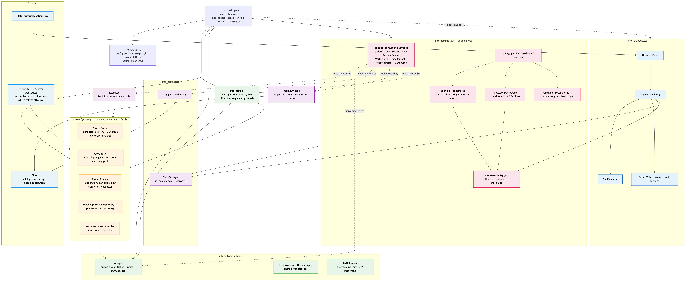
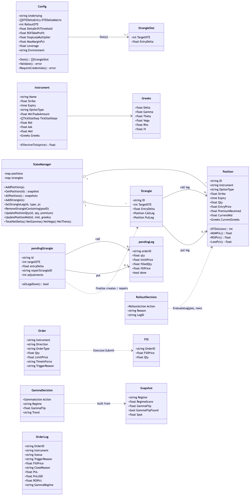
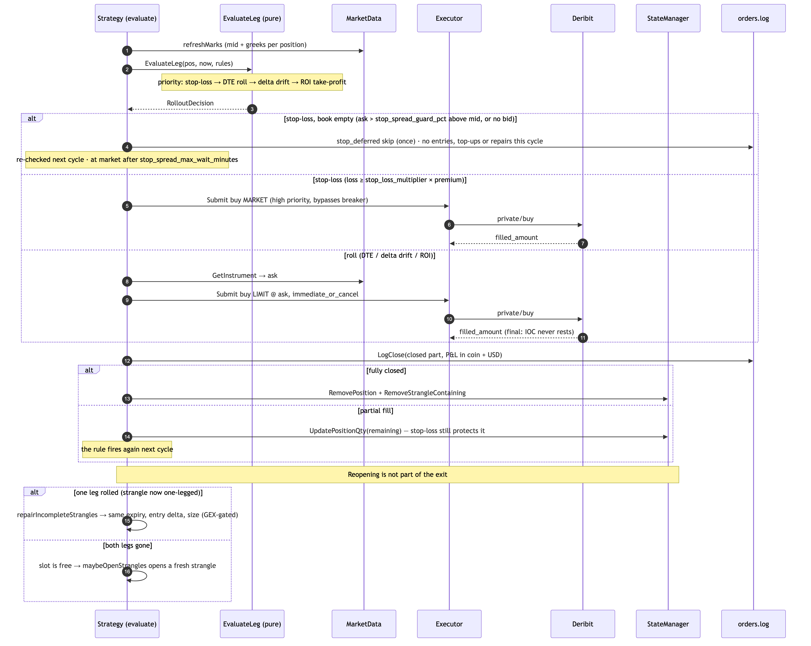

# optionsBot — automated short-volatility options bot for Deribit (Go)

[](https://github.com/rchau73/optionsBot/actions/workflows/ci.yml)


A concurrent Go service that sells BTC/ETH option strangles on [Deribit](https://www.deribit.com), manages them through their life (fill tracking, take-profit, rolls, stop-loss, regime-based leg shedding, kill switch) and backtests the same rules on historical data.

> **⚠️ Disclaimer — read first.** This is a personal **software-engineering study**: a Go concurrency and system-design exercise that runs against a real derivatives exchange. It is **not** a professional trading tool and **not investment advice**. Selling options can lose far more than the premium collected, and crypto markets are extremely volatile. The bot runs on Deribit **testnet by default**; live trading requires an explicit `DERIBIT_ENV=live`. Use at your own risk.

**How the strategy works, in plain language, with examples:** [OptionStrategy.md](OptionStrategy.md).

---

## Contents
- [Highlights](#highlights)
- [Architecture](#architecture)
- [Data model](#data-model)
- [Key flows](#key-flows)
- [Concurrency model](#concurrency-model)
- [Getting started](#getting-started)
- [Configuration](#configuration)
- [Backtesting](#backtesting)
- [Testing and CI](#testing-and-ci)
- [Project layout](#project-layout)
- [Design decisions](#design-decisions)
- [Known limitations and roadmap](#known-limitations-and-roadmap)
- [Further documentation](#further-documentation)

## Highlights

- **Exchange gateway built for safety:** one WebSocket, priority lanes (stop-loss and kill switch first), Deribit's two rate-limit pools, a circuit breaker that never blocks risk-reducing orders, retries only for idempotent reads, reply routing by request ID (no head-of-line blocking), automatic reconnect with re-subscription.
- **Fill-safe order handling:** partial fills are booked as filled, timed-out entries keep their filled legs, closes use market or immediate-or-cancel orders so the result is always known, rollouts only close and a single fill-tracked path reopens.
- **Stateless by design:** the in-memory book is rebuilt from the exchange on every start (reconcile), so crashes and restarts are recoverable.
- **SOLID Go:** the strategy depends on small, consumer-defined interfaces; decision rules are pure functions (time passed in) shared by the live loop and the backtest.
- **Market-structure aware:** dealer gamma exposure (GEX) from **mainnet** open interest even when trading on testnet (testnet positioning isn't real), matching GestaoCarteira's `deribit_tc_export_v3.py` rules; DVOL-based IV percentile.
- **Decision journal with P&L:** every submit, amend, cancel, fill, close, reconcile and skipped entry in `orders.log` carries a market snapshot (spot, DVOL, IV percentile and skew, ITM/ATM/OTM and distance to strike, open interest of the strike/expiry with rank and max pain, GEX regime, spread), and P&L per strategy slot (realised, unrealised, coin and USD) is journaled periodically.
- **Tested:** 87 % statement coverage, end-to-end strategy tests against a fake exchange, gateway integration tests against a mock Deribit WebSocket server, all under the race detector in CI, plus `govulncheck` and a Docker build.

## Architecture



<sub>Source: [docs/arch_overview.mmd](docs/arch_overview.mmd) · all diagrams: [docs/README.md](docs/README.md)</sub>

| Layer | Package | Role |
|---|---|---|
| Composition | `cmd/bot` | Flags, logger, config, wiring; `SIGUSR1` → kill switch; live or backtest mode |
| Platform | `internal/gateway` | The only Deribit connection: queue → rate limiter → circuit breaker → socket; replies routed by ID; reconnect |
| Market | `internal/marketdata` | Option chain, ticker/index/DVOL subscriptions, IV percentile, shared expiry-window rule |
| Market | `internal/gex` | Gamma exposure regime from open interest, refreshed every 60 s |
| Decision | `internal/strategy` | Entry, fill tracking, exits, repair, reconcile, rebalance, kill switch; pure rule functions |
| Execution | `internal/orders` | Deribit order/account calls, in-memory book (snapshots), `orders.log` decision journal (market snapshot + P&L) |
| Monitoring | `internal/api` | Read-only JSON API for the live monitor, built from in-memory state (no exchange calls); UI in [`frontend/`](frontend/README.md) |
| Reporting | `internal/hedge` | `hedge_report.json` — suggestion only, never trades |
| Research | `internal/backtest` | CSV replay, simulated fills, metrics, parameter sweep, walk-forward |
| Support | `internal/config`, `internal/logger` | `config.yaml` + `.env` with validation; `slog` JSON logging |

Full design notes: [docs/architecture.md](docs/architecture.md).

## Data model



`StateManager` owns positions and strangles (a strangle links a call and a put leg by position ID). Entry orders live in a `pendingStrangle` until every leg is done; pure functions turn positions into `RolloutDecision`s and the GEX snapshot into a `GammaDecision`.

## Key flows

| Flow | Diagram |
|---|---|
| Startup and reconcile with the exchange | [seq_startup](docs/seq_startup.png) |
| Entry: sizing, gating, submit, fill tracking, amend, timeout | [seq_entry](docs/seq_entry.png) |
| Exit: stop-loss and rollouts, partial fills, who reopens | [seq_exit](docs/seq_exit.png) |
| Gateway request, reply routing, reconnect | [seq_gateway](docs/seq_gateway.png) |
| GEX refresh and leg gating | [seq_gex](docs/seq_gex.png) |
| Kill switch | [seq_kill_switch](docs/seq_kill_switch.png) |



## Concurrency model

| Goroutine | Purpose | Stops on |
|---|---|---|
| gateway `readLoop` / `dispatchLoop` | single reader / single writer per connection | connection context |
| gateway `heartbeatLoop`, `metricsLoop` | keep-alive, rate-limit metrics | connection context |
| gateway `reconnect` | at most one; restores the session | root context |
| marketdata consumer | applies ticker/index/DVOL pushes | root context |
| GEX refresher | recomputes the regime every 60 s | root context |
| `strategy.Run` | **all trading decisions** (never concurrent with each other) | root context / kill switch |
| strategy heartbeat | read-only status log every 60 s | root context |

Shared state is guarded by mutexes held only for in-memory work, never across a network call; readers receive copies. The test suite runs with `-race`.

## Getting started

**Prerequisites:** Go 1.25+, a Deribit **testnet** account with an API key (`account:read`, `trade:read_write`); Docker optional; [`mmdc`](https://github.com/mermaid-js/mermaid-cli) only to re-render diagrams.

```bash
git clone https://github.com/rchau73/optionsBot && cd optionsBot
cp .env.example .env              # add your testnet key; DERIBIT_ENV=testnet
make check                        # gofmt + vet + race tests
make build                        # → ./bot
./bot --config config_btc.yaml    # trade on testnet
./bot --config config_btc.yaml --debug
```

With Docker (one container per underlying, non-root, restart on failure):

```bash
docker compose up -d bot-btc
docker compose logs -f bot-btc
```

| Command | What it does |
|---|---|
| `./bot --config config_btc.yaml` | trade (testnet unless `DERIBIT_ENV=live`) |
| `./bot --mode=backtest --config config_btc.yaml --from=2023-01-01 --to=2023-12-31` | backtest + walk-forward |
| `./bot --mode=backtest --config config_btc.yaml --sweep=true --from=… --to=…` | parameter sweep |
| `kill -USR1 <pid>` / `docker kill -s USR1 <container>` | kill switch: flatten and halt |

Day-to-day operation (logs, health monitor, kill switch, BTC + ETH, troubleshooting): [docs/operations.md](docs/operations.md).

## Configuration

Two files with a strict split: **`config.yaml`** (or `config_btc.yaml` / `config_eth.yaml`) holds strategy logic; **`.env`** holds platform settings. Config is validated on startup and a bad value stops the bot with a clear message.

### Strategy — `config_*.yaml`

| Key | Default | Meaning |
|---|---|---|
| `underlying` | — | `BTC` or `ETH` |
| `strategy_id` | `short-strangle` | names the strategy in `orders.log` and in Deribit order labels (`<id>:<dte>d:<delta>`) |
| `dte_delta_matrix` | — | slots: each `dte` with one or more `deltas`; one strangle per (DTE, delta) |
| `rollout_dte` | — | roll a leg when days to expiry ≤ this; every slot DTE must be above it |
| `delta_drift_threshold` | — | roll a leg when \|delta\| falls below this (little premium left). At most 75% of every entry delta, or a new leg would be rolled by the first small move, over and over |
| `roi_take_profit` | — | roll a leg once this share of the premium is captured (0.5 = 50 %) |
| `stop_loss_multiplier` | — | close at market when the loss reaches this × premium received |
| `delta_exit_threshold` | 0.30 | close a short leg (IOC at the ask) when its \|delta\| reaches this — before the stop; the leg is then held like a stopped one. Must be above every entry delta |
| `max_leg_size_multiple` | 2 | a new leg is at most this × its slot's normal size (slot share ÷ the strangle's margin per lot on its own) — book offsets can make a leg look almost free |
| `repair_cooldown_hours` | 72 | a stopped-out leg is re-sold no sooner than this, and only when entries are not frozen and the confirmed gamma regime is not negative (rolled legs reopen at once) |
| `iv_margin_bands` | ≥70 → 50, ≥30 → 35, ≥0 → 20 | initial-margin limit (% of Deribit's margin balance) by DVOL IV-percentile band; the lowest band must start at 0. A confirmed negative gamma regime forces the lowest band |
| `iv_band_confirm_days` | 2 | consecutive UTC daily closes a DVOL band or gamma regime change must hold before the limit moves; until then new entries are frozen |
| `max_mm_pct` | 35 | maintenance-margin limit (% of margin balance), enforced at once by reducing positions; below 100 (Deribit liquidates at 100) |
| `max_dte_deviation` | 2 | days an expiry may differ from the slot DTE |
| `expiry_stretch` | 1.5 | slots keep separate expiries: when another slot holds a slot's expiry, it takes the nearest free one up to target DTE × this (1–3), otherwise it waits. Deribit lists weeklies only a few weeks out, then month-/quarter-ends, so nearby slots (45/60) would often share one |
| `delta_slippage` | 0 | max distance from the target delta (0 = take the closest) |
| `min_premium_btc` | 0 | skip legs whose price is below this (0 = off) |
| `min_trade_amount` | 0.05 | fallback lot size when the exchange does not provide one |
| `eval_interval_ms` | 35000 | decision-loop period |
| `report_interval_sec` | 60 | heartbeat and P&L journal line period |
| `order_fill_timeout_sec` | 90 | cancel unfilled entry legs after this |
| `order_slippage_pct` / `order_max_adjustments` | 0.05 / 3 | amend a resting entry when the ask drifts by more than this, at most N times |
| `gamma_trend_lookback_days`, `swing_pivot_n` | — / 3 | trend detection from daily closes |
| `gex_method` | `script` | `script` = GestaoCarteira's rules (regime = sign of weighted GEX, flip = lowest crossing); `nearest_flip` = crossing nearest spot, regime = spot vs flip, with hysteresis |
| `gex_strike_range_pct` | 0 | strikes used for GEX: ±this of each expiry's underlying (shipped configs: 0.15, as the script; 0 = all) |
| `gamma_regime_band_pct` | 0.01 | hysteresis band around the flip (`nearest_flip` only) |
| `iv_percentile_window` | — | days of DVOL history for the IV percentile |
| `hedge_report_threshold` | — | \|net delta\| that triggers a hedge report |
| `spread_alert_threshold` | — | warn when a fill's bid/ask spread exceeds this |
| `backtest.*` | — | fill model, slippage, limit-fill rule, commission |

### Platform — `.env`

| Key | Default | Meaning |
|---|---|---|
| `DERIBIT_CLIENT_ID`, `DERIBIT_CLIENT_SECRET` | — | API credentials (needed to trade, not to backtest); never logged |
| `DERIBIT_ENV` | `testnet` | `testnet` or `live` (anything else is rejected) |
| `DERIBIT_RATE_WS_NONMATCH_RPS` / `_WS_MATCH_RPS` | 20 / 8 | Deribit credit pools: general requests / order operations |
| `DERIBIT_RATE_SAFETY_FACTOR` | 0.80 | use at most this share of each limit |
| `DERIBIT_RATE_MAX_SUBSCRIPTIONS` | 1000 | subscription cap |
| `DERIBIT_BACKOFF_*` | 500 ms × 2, max 30 s, 6 retries | retry policy for read-only calls |
| `DERIBIT_CIRCUIT_BREAKER_THRESHOLD` / `_OPEN_SEC` | 5 / 60 | failures that open the breaker / how long it stays open |
| `DERIBIT_HEARTBEAT_INTERVAL_SEC` | 15 | server heartbeat interval |
| `DERIBIT_RECONNECT_MAX_ATTEMPTS` / `_BACKOFF_BASE_MS` | 10 / 1000 | reconnect policy before giving up |
| `BOT_ACCOUNT_POLL_SEC` | 10 | how often the account/collateral summary is polled for the monitor (one read-only call; minimum 2) |
| `BOT_API_ADDR` | empty (off) | address of the read-only monitor API, e.g. `127.0.0.1:8081`; Docker Compose sets it per service |

## Backtesting

```bash
go run ./cmd/gendata                                       # synthetic data → data/historical/options.csv
./bot --mode=backtest --config config_btc.yaml --from=2026-01-01 --to=2026-12-31
./bot --mode=backtest --config config_btc.yaml --sweep=true --from=2026-01-01 --to=2026-12-31
```

The engine replays the CSV day by day and applies the same pure decision functions as the live bot **at the simulated date**. Output in `data/results/`: `summary.json` (Sharpe, Sortino, Calmar, drawdown, win rate, exits by reason), `trades.csv`, `equity_curve.csv`, `drawdown.csv`, `scenario_comparison.csv` (sweep, ranked by Sharpe) and `walk_forward/` (train/validate windows, overfit flag at > 30 % Sharpe degradation).

CSV columns: `date, instrument, underlying, underlying_price, strike, expiry, option_type, bid, ask, mid, delta, gamma, theta, vega, iv, dvol_index`. The generator produces USD prices with monthly expiries — good for testing mechanics, not for judging profitability. Real Deribit history is available from the API (candles, DVOL, expired instruments) or vendors such as Tardis.dev.

## Testing and CI

```bash
make test      # go test ./tests/... -race
make cover     # coverage across ./internal/... (tests live in ./tests)
make check     # what CI runs: gofmt, vet, race tests
```

| Package | Coverage | Highlights |
|---|---|---|
| strategy | 85 % | black-box tests of `Strategy.Run` against a fake exchange: entry pricing, premium floor, partial fills, timeouts, amend on drift, rollouts, stop-loss, GEX gating, repair, reconcile, rebalance, kill switch |
| gateway | 87 % | real `Gateway` against a scriptable mock Deribit WebSocket: no head-of-line blocking, breaker policy, retry policy, fail-fast on disconnect, reconnect with re-subscription |
| marketdata, gex, orders, config, hedge | 92–97 % | push handling, DVOL history, expiry window, order journal, validation |
| backtest | 81 % | historical-date regression, writers, sweep, walk-forward |

Regression tests for critical fixes were mutation-checked: they fail when the fix is reverted. CI (`.github/workflows/ci.yml`) runs formatting, vet, race tests with a coverage summary, `govulncheck` and a Docker build on every push and pull request.

## Project layout

```
cmd/bot/              main: wiring, flags, signals
cmd/gendata/          synthetic historical data generator
internal/config/      config.yaml + .env loading and validation
internal/gateway/     Deribit WebSocket client (queue, limits, breaker, retry, reconnect)
internal/marketdata/  option chain, subscriptions, DVOL / IV percentile, expiry window
internal/gex/         gamma exposure and regime
internal/strategy/    decision loop (open, pending, close, repair, reconcile, rebalance, killswitch) + pure rules
internal/orders/      executor, in-memory book, order journal, price/lot rounding
internal/hedge/       hedge report
internal/backtest/    feed, simulated executor, engine, metrics, results, scenarios
tests/                all tests (unit, integration, end-to-end)
docs/                 architecture, operations, Mermaid sources + PNGs
frontend/             live monitor (Next.js) — see frontend/README.md
cmd/monitor-demo/     monitor API with simulated data, for UI development
```

## Design decisions

| Decision | Why |
|---|---|
| One WebSocket per process, all calls through the gateway | Deribit limits are per account; one place enforces them, prioritises risk orders and observes health |
| Writer never waits for replies | a slow reply must not delay a stop-loss queued behind it |
| Never retry orders | a "failed" order may already be on the book; retrying could double the position |
| Exchange as source of truth, state in memory | no database to drift out of sync; reconcile on start is simpler and safer |
| Rollouts only close | one fill-tracked path opens legs, which removed a duplicate-exposure bug |
| Consumer-defined interfaces + pure rule functions | testable without the exchange; rules shared with the backtest |
| Time passed into rule functions | the backtest replays the past correctly (it once silently used the wall clock) |
| Kill switch stays idle instead of exiting | an exit would let Docker restart the bot straight back into trading |
| Hedge is report-only | automated hedging is a product decision, not a refactor |

## Known limitations and roadmap

- The backtest engine runs the shared pure rules in its own day loop rather than the live `Strategy`; order-lifecycle behaviour is covered by end-to-end tests and testnet. **Next:** run `Strategy` itself against the simulated executor.
- Synthetic backtest data only; add a real Deribit dataset and an open-interest collector.
- Multiple strategies per process with per-strategy order labels, versioning and an audit trail.
- Live monitor: phase 1 (read-only, in-session) is in `frontend/`; next are persisted history, change markers and authenticated controls per the dashboard spec.

## Further documentation

| Document | Content |
|---|---|
| [OptionStrategy.md](OptionStrategy.md) | the strategy in plain language: rules, worked examples, risks |
| [docs/architecture.md](docs/architecture.md) | detailed design, invariants, limitations |
| [docs/operations.md](docs/operations.md) | running, monitoring, kill switch, troubleshooting |
| [docs/README.md](docs/README.md) | diagram index (Mermaid sources + 4× PNGs) |
| [CLAUDE.md](CLAUDE.md) | guidance for AI-assisted development in this repo |

---

<sub>Educational study of an automated trading system — not investment advice.</sub>
