# Options Bot — Architecture Documentation

## Diagrams Index

| Diagram | Description | Mermaid Source | PNG |
|---------|-------------|----------------|-----|
| [Architecture Overview](#architecture-overview) | All engines and their integration | [arch_overview.mmd](arch_overview.mmd) | [arch_overview.png](arch_overview.png) |
| [Gateway — Request Flow](#gateway--request-flow) | WS connection, dispatch, reconnect, retry | [gateway_flow.mmd](gateway_flow.mmd) | [gateway_flow.png](gateway_flow.png) |
| [Gateway — Rate Limiter](#gateway--rate-limiter) | 4-scope token buckets with safety factor | [gateway_ratelimiter.mmd](gateway_ratelimiter.mmd) | [gateway_ratelimiter.png](gateway_ratelimiter.png) |
| [Gateway — Circuit Breaker](#gateway--circuit-breaker-state) | Closed → Open → HalfOpen state machine | [gateway_circuitbreaker.mmd](gateway_circuitbreaker.mmd) | [gateway_circuitbreaker.png](gateway_circuitbreaker.png) |
| [MarketData — Flow](#marketdata--flow) | Options chain load, selective subscription, DVOL | [marketdata_flow.mmd](marketdata_flow.mmd) | [marketdata_flow.png](marketdata_flow.png) |
| [Strategy — Event Loop](#strategy--event-loop) | Main tick-driven loop, gamma, kill switch | [strategy_eventloop.mmd](strategy_eventloop.mmd) | [strategy_eventloop.png](strategy_eventloop.png) |
| [Strategy — Entry Logic](#strategy--entry-logic) | Expiry + strike selection, margin guard | [strategy_entry.mmd](strategy_entry.mmd) | [strategy_entry.png](strategy_entry.png) |
| [Strategy — Rollout Rules](#strategy--rollout-rules-priority-order) | Rules 4.1–4.5 priority decision tree | [strategy_rollout.mmd](strategy_rollout.mmd) | [strategy_rollout.png](strategy_rollout.png) |
| [Strategy — Position States](#strategy--position-lifecycle-state-diagram) | Position lifecycle state machine | [strategy_position_states.mmd](strategy_position_states.mmd) | [strategy_position_states.png](strategy_position_states.png) |
| [Orders — Flow](#orders--flow) | Executor, state manager, order logger | [orders_flow.mmd](orders_flow.mmd) | [orders_flow.png](orders_flow.png) |
| [Backtest — Simulation Loop](#backtest--simulation-loop) | Daily engine, fill models, results | [backtest_flow.mmd](backtest_flow.mmd) | [backtest_flow.png](backtest_flow.png) |
| [Backtest — SimExecutor](#backtest--simexecutor-fill-models) | Limit/market/slippage fill models | [backtest_simexec.mmd](backtest_simexec.mmd) | [backtest_simexec.png](backtest_simexec.png) |
| [Hedge — Reporter](#hedge--reporter-flow) | Delta report generation | [hedge_flow.mmd](hedge_flow.mmd) | [hedge_flow.png](hedge_flow.png) |

---

## Architecture Overview

> All engines, data flows, and external integrations at a glance.

---

## Gateway — Request Flow

> WebSocket connection lifecycle: auth, dispatch loop, rate limiting, retry with jitter, reconnect, and subscription batching.

**Inputs:** `Call(ctx, method, params, priority)` from any engine  
**Outputs:** `JSONRPCResponse` to caller; `Tick` notifications to MarketData  
**State:** pending requests map, subscription registry, circuit breaker counters

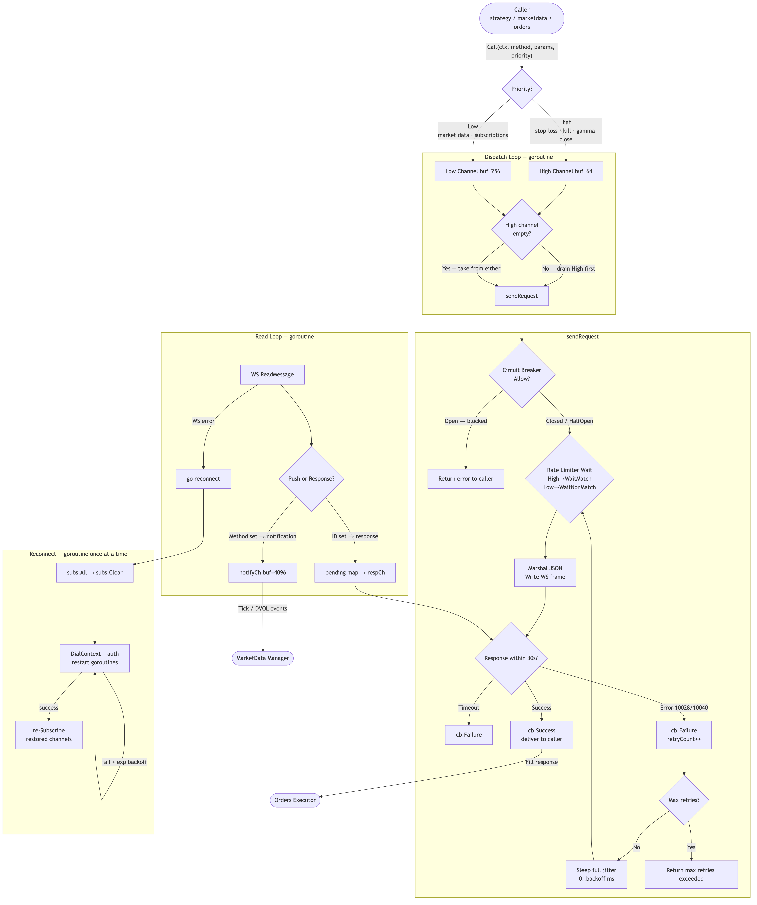

## Gateway — Rate Limiter

> Four independent token buckets, each scaled by a configurable safety factor (default 0.80) to stay within Deribit hard limits.

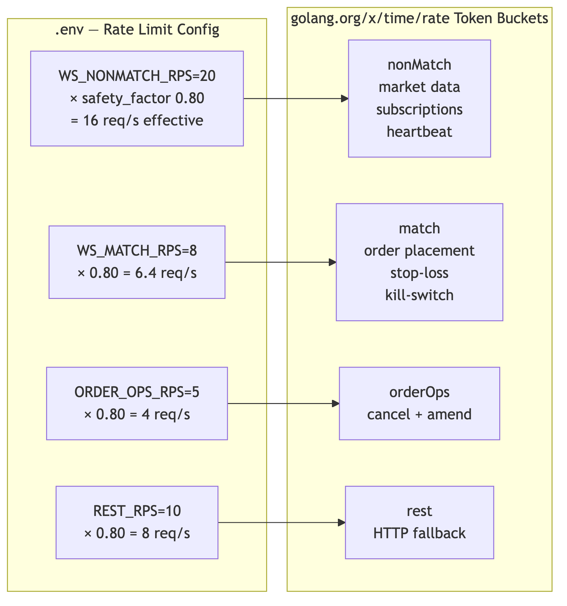

## Gateway — Circuit Breaker State

> Opens after 5 consecutive failures; allows a single probe after 60s; closes on probe success.  
> While Open the bot enters **safe-idle**: no new orders, existing positions held.

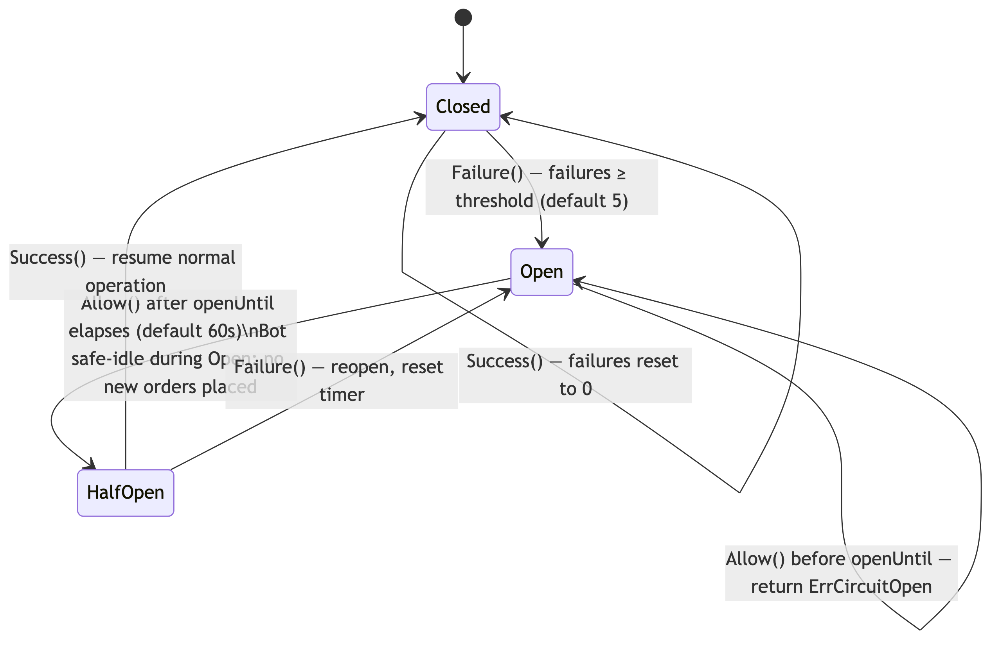

---

## MarketData — Flow

> Loads the full options chain (~1040 instruments) at startup but **subscribes only to instruments for the target expiries** (+ next 3 future expiries for rollout). This keeps active subscriptions at ~200–600 instead of 1040+, avoiding testnet subscription limits that caused `Mid=0` on all candidates.

**Inputs:** `public/get_instruments` response; ticker notifications; DVOL pushes  
**Outputs:** `Tick` channel → Strategy; `IVPercentile()` → MarginGuard; `AllInstruments()` → entry logic  
**Key data:** Instrument cache (bid/ask/mid/greeks/IV/minTradeAmount), 252-day DVOL rolling window

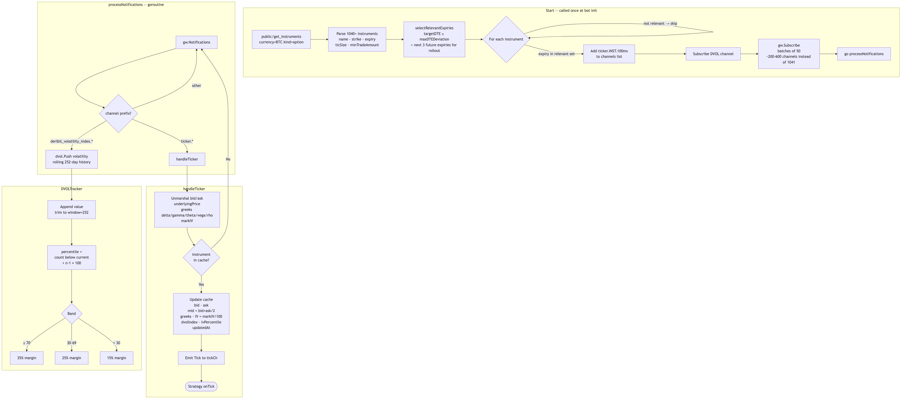

---

## Strategy — Event Loop

> Tick-driven main loop. Every incoming tick updates position state, runs the gamma monitor, evaluates all rollout rules for each position, and checks whether new strangles should be opened.

**Inputs:** `Tick` from MarketData; SIGUSR1 / killSwitchCh  
**Outputs:** `Order` requests to Executor; hedge report triggers  

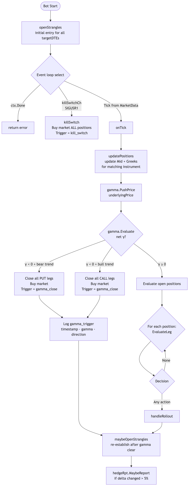

## Strategy — Entry Logic

> Selects the nearest available expiry within ±`maxDTEDeviation` days of each target DTE, finds the OTM call and put with |δ| ≈ 0.16, re-quantizes the order size against the exchange's actual `min_trade_amount`, and checks the IV-risk margin band before submitting.

**Inputs:** `AllInstruments()`, account equity, IV percentile  
**Outputs:** Sell limit orders for call + put legs

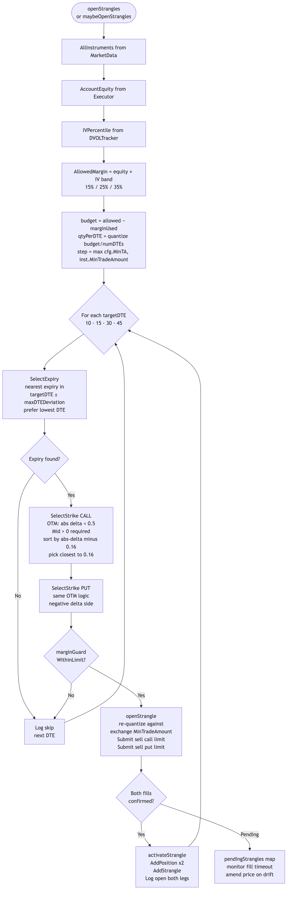

## Strategy — Rollout Rules (Priority Order)

> Rules are evaluated in strict priority order. A higher-priority rule prevents lower ones from applying on the same tick.

| Rule | Trigger | Order type | Scope |
|------|---------|-----------|-------|
| 4.5 Stop-loss | Loss ≥ 200% of premium | **Market** — immediate | Single leg |
| 4.1 19 DTE | DTE ≤ rolloutDTE | Limit → market fallback (1 day) | Whole strangle |
| 4.2 Delta drift | \|δ\| < 0.10 AND DTE ≥ 25 | Limit at favorable price | Single leg |
| 4.3 ROI take-profit | ROI ≥ 50% AND DTE ≥ 25 | Limit, continuously updated | Single leg |

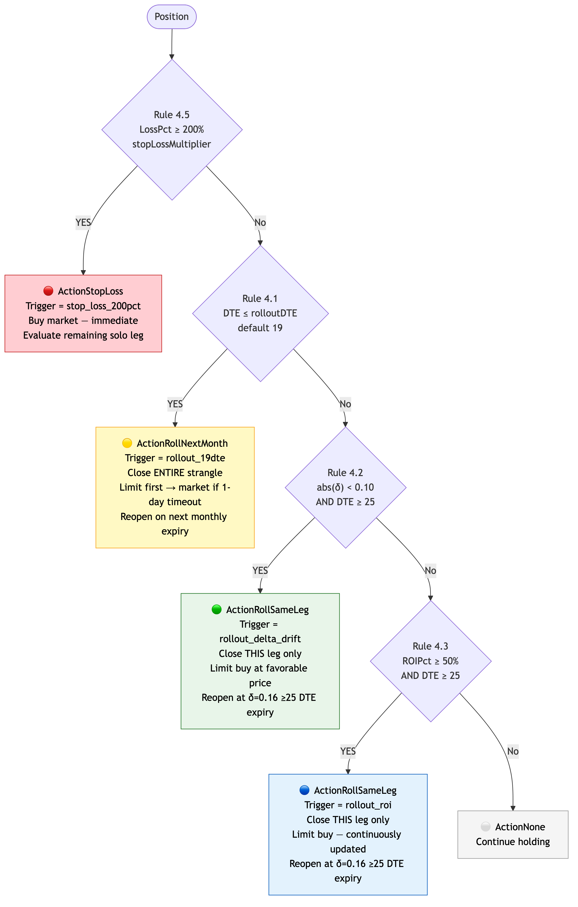

## Strategy — Position Lifecycle State Diagram

> Every position starts as `PendingFill` and ends in `Closed`. The closed state is the only permanent terminal state; all transitions are driven by market events or operator actions.

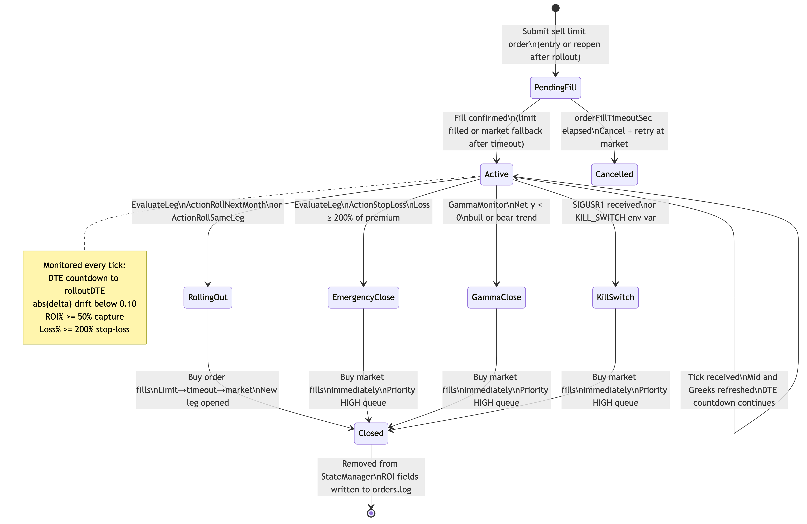

---

## Orders — Flow

> Wraps the Deribit private API with priority routing (emergency orders → High queue), maintains an in-memory state view of all open positions and strangles, and writes every order event as a structured JSON line to `orders.log`.

**Inputs:** `Order{instrument, direction, type, qty, limitPrice, triggerReason}`  
**Outputs:** `Fill{orderID, fillPrice, qty, timestamp}`; updated StateManager; JSON line in orders.log

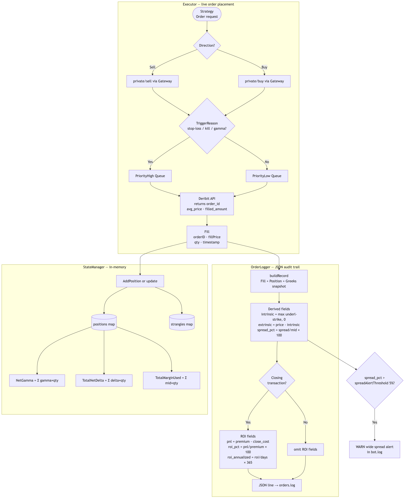

---

## Backtest — Simulation Loop

> The same strategy decision logic (rollout rules, gamma monitor, margin guard) runs against historical CSV data. The only difference is the data source (`HistoricalFeed`) and executor (`SimExecutor`). Results are written to `data/results/`.

**Inputs:** `data/historical/options.csv` (date, instrument, greeks, DVOL per row)  
**Outputs:** `summary.json`, `trades.csv`, `equity_curve.csv`, `drawdown.csv`; optionally `scenario_comparison.csv` and `walk_forward/`



## Backtest — SimExecutor Fill Models

> Three configurable fill models. The `next_tick` limit rule closely mirrors live behaviour: a limit order fills on the next day's tick if the price condition is met, otherwise expires to market after 24 simulated hours.

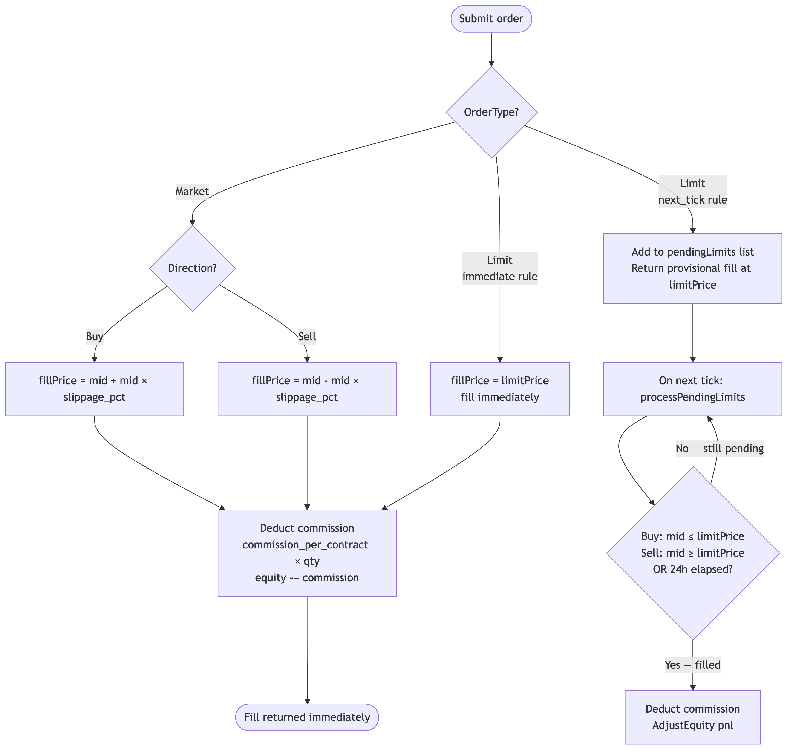

---

## Hedge — Reporter Flow

> Computes uncovered delta exposure across all open positions and writes a structured report to `hedge_report.json`. **The bot never places futures orders.** The report is a manual-action prompt only.

**Inputs:** `netDelta`, `underlyingPrice` from StateManager  
**Outputs:** `hedge_report.json` (overwritten on each refresh); structured log entry in `bot.log`  
**Threshold:** Only refreshes when delta changes > 5% (configurable via `hedge_report_threshold`)

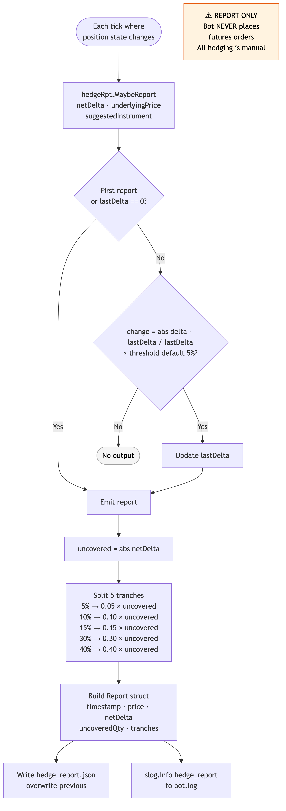
