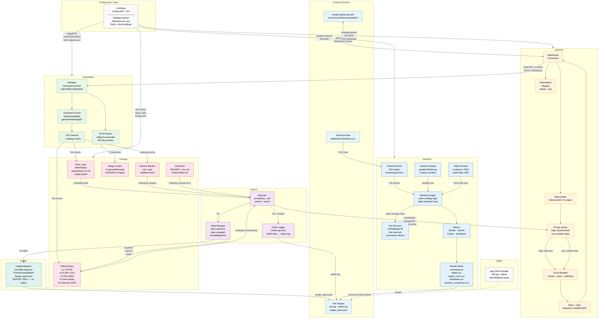

```mermaid
graph TB
    subgraph EXTERNAL["External Systems"]
        DERIBIT_WS["Deribit WebSocket API\nwss://test.deribit.com/ws/api/v2"]
        FILES["File Outputs\nbot.log · orders.log\nhedge_report.json"]
        HIST_DATA["Historical Data\ndata/historical/options.csv"]
    end

    subgraph CONFIG["Configuration Layer"]
        CFG["config.go\nconfig.yaml + .env\n─────────────────\nStrategy params\nRate-limit env vars\nRetry / circuit settings"]
    end

    subgraph GATEWAY["gateway/"]
        GW_CONN["WebSocket\nConnection"]
        GW_RL["Rate Limiter\ntoken bucket ×4 scopes"]
        GW_CB["Circuit Breaker\nClosed→Open→HalfOpen"]
        GW_RETRY["Retry + Jitter\nbackoff on 10028/10040"]
        GW_PQ["Priority Queue\nHigh (stop-loss/kill)\nLow (market data)"]
        GW_SUBS["Subscription\nRegistry\ndedup + cap"]
    end

    subgraph MARKETDATA["marketdata/"]
        MD_MGR["Manager\nfetchOptionsChain\nselectRelevantExpiries"]
        MD_DVOL["DVOLTracker\nrolling IV percentile\n252-day window"]
        MD_INST["Instrument Cache\nbid/ask/mid/delta\ngamma/theta/vega/IV"]
        MD_TICK["Tick Channel\n→ strategy events"]
    end

    subgraph STRATEGY["strategy/"]
        ST_ENTRY["Entry Logic\nSelectExpiry\nSelectStrike δ≈0.16\nmargin guard"]
        ST_ROLLOUT["Rollout Rules\n4.1 19 DTE\n4.2 δ drift <0.10\n4.3 ROI ≥50%\n4.4 limit priority\n4.5 stop-loss 200%"]
        ST_GAMMA["Gamma Monitor\nnet γ sign\nbull/bear trend"]
        ST_MARGIN["Margin Guard\nIV percentile bands\n15/25/35% of equity"]
        ST_KILL["Kill Switch\nSIGUSR1 + env var\nmarket flatten all"]
    end

    subgraph ORDERS["orders/"]
        ORD_EXEC["Executor\nprivate/buy · sell\namend · cancel"]
        ORD_STATE["State Manager\nopen positions\nopen strangles\nnet delta/gamma"]
        ORD_LOG["Order Logger\nOrderLog struct\nJSON lines → orders.log"]
    end

    subgraph HEDGE["hedge/"]
        HG_RPT["Hedge Reporter\nnet delta exposure\n5-tranche breakdown\nhexge_report.json\nREPORT ONLY — no orders"]
    end

    subgraph BACKTEST["backtest/"]
        BT_FEED["Historical Feed\nCSV loader\nchronological ticks"]
        BT_EXEC["Sim Executor\nmid/slippage fill\nlimit next-tick\ncommission deduct"]
        BT_ENG["Backtest Engine\nsame strategy logic\ndaily simulation loop"]
        BT_METRICS["Metrics\nSharpe · Sortino\nCalmar · drawdown"]
        BT_SWEEP["Scenario Sweep\nparallel WaitGroup\n5 param combos"]
        BT_WF["Walk-Forward\n4 windows 75/25\noverfit flag >30%"]
        BT_OUT["Results Writer\nsummary.json\ntrades.csv\nequity_curve.csv\ndrawdown.csv\nscenario_comparison.csv"]
    end

    subgraph LOGGER["logger/"]
        LOG["slog JSON Handler\nbot.log + stdout\nINFO/DEBUG levels"]
    end

    %% Config feeds everything
    CFG -->|"strategy params\nrate limits\nenv credentials"| GATEWAY
    CFG -->|"targetDTE\nmaxDTEDeviation\nMinTradeAmount"| MARKETDATA
    CFG -->|"entry delta\nrollout rules\nmargin pcts"| STRATEGY
    CFG -->|"backtest params\nfill model"| BACKTEST

    %% Gateway ↔ Deribit
    DERIBIT_WS <-->|"JSON-RPC 2.0\nWebSocket frames"| GW_CONN
    GW_CONN --> GW_RL --> GW_PQ
    GW_PQ -->|"High: stop-loss"| GW_CB
    GW_PQ -->|"Low: market data"| GW_CB
    GW_CB --> GW_RETRY --> GW_CONN
    GW_CONN --> GW_SUBS

    %% Gateway → MarketData
    GW_CONN -->|"ticker.BTC-X.100ms\nDVOL notifications"| MD_MGR
    MD_MGR --> MD_DVOL
    MD_MGR --> MD_INST
    MD_INST --> MD_TICK

    %% MarketData → Strategy (live)
    MD_TICK -->|"Tick events"| ST_ENTRY
    MD_TICK -->|"Tick events"| ST_ROLLOUT
    MD_TICK -->|"underlying price"| ST_GAMMA
    MD_DVOL -->|"IV percentile"| ST_MARGIN

    %% Strategy → Orders
    ST_ENTRY -->|"Order{sell limit}"| ORD_EXEC
    ST_ROLLOUT -->|"Order{buy limit/market}"| ORD_EXEC
    ST_GAMMA -->|"Order{buy market}"| ORD_EXEC
    ST_KILL -->|"Order{buy market ALL}"| ORD_EXEC

    %% Orders → State + Log
    ORD_EXEC -->|"Fill"| ORD_STATE
    ORD_EXEC -->|"Fill + Greeks"| ORD_LOG
    ORD_STATE -->|"positions\ngamma\ndelta"| ST_ROLLOUT
    ORD_STATE -->|"net delta"| HG_RPT

    %% Orders → Gateway
    ORD_EXEC -->|"private/buy\nprivate/sell\nprivate/cancel"| GW_PQ

    %% Hedge output
    HG_RPT -->|"hedge_report.json"| FILES
    ORD_LOG -->|"orders.log"| FILES

    %% Backtest path
    HIST_DATA -->|"CSV rows"| BT_FEED
    BT_FEED -->|"Tick stream"| BT_ENG
    BT_ENG -->|"same strategy rules"| BT_EXEC
    BT_ENG --> BT_METRICS
    BT_SWEEP -->|"parallel runs"| BT_ENG
    BT_WF -->|"75/25 split runs"| BT_ENG
    BT_METRICS --> BT_OUT
    BT_OUT -->|"results/"| FILES

    %% Logging
    LOG -.->|"structured JSON events"| FILES

    classDef external fill:#e8f4f8,stroke:#2196F3,color:#000
    classDef gateway fill:#fff3e0,stroke:#FF9800,color:#000
    classDef marketdata fill:#e8f5e9,stroke:#4CAF50,color:#000
    classDef strategy fill:#fce4ec,stroke:#E91E63,color:#000
    classDef orders fill:#f3e5f5,stroke:#9C27B0,color:#000
    classDef hedge fill:#e0f2f1,stroke:#009688,color:#000
    classDef backtest fill:#e3f2fd,stroke:#1565C0,color:#000
    classDef config fill:#fafafa,stroke:#607D8B,color:#000
    classDef logger fill:#fafafa,stroke:#607D8B,color:#000

    class DERIBIT_WS,FILES,HIST_DATA external
    class GW_CONN,GW_RL,GW_CB,GW_RETRY,GW_PQ,GW_SUBS gateway
    class MD_MGR,MD_DVOL,MD_INST,MD_TICK marketdata
    class ST_ENTRY,ST_ROLLOUT,ST_GAMMA,ST_MARGIN,ST_KILL strategy
    class ORD_EXEC,ORD_STATE,ORD_LOG orders
    class HG_RPT hedge
    class BT_FEED,BT_EXEC,BT_ENG,BT_METRICS,BT_SWEEP,BT_WF,BT_OUT backtest
    class CFG config
    class LOG logger
```
