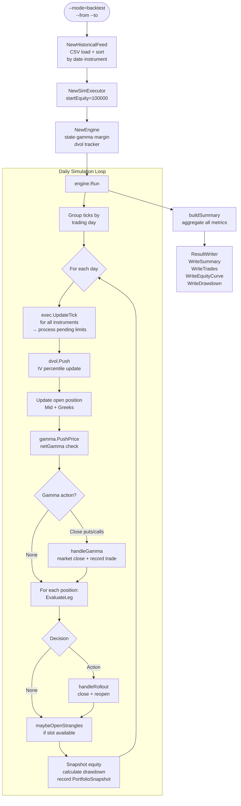
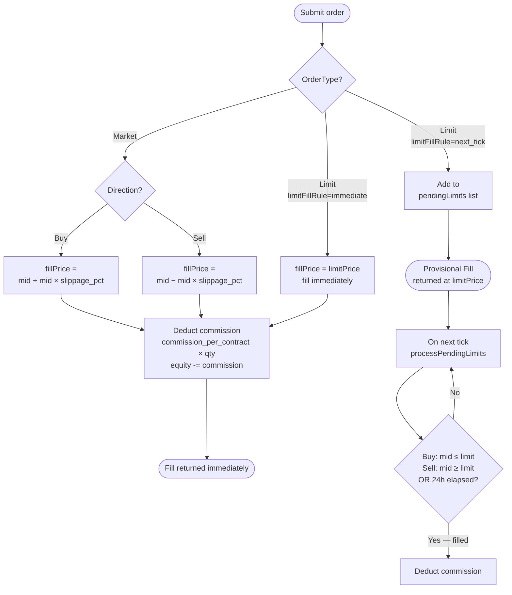
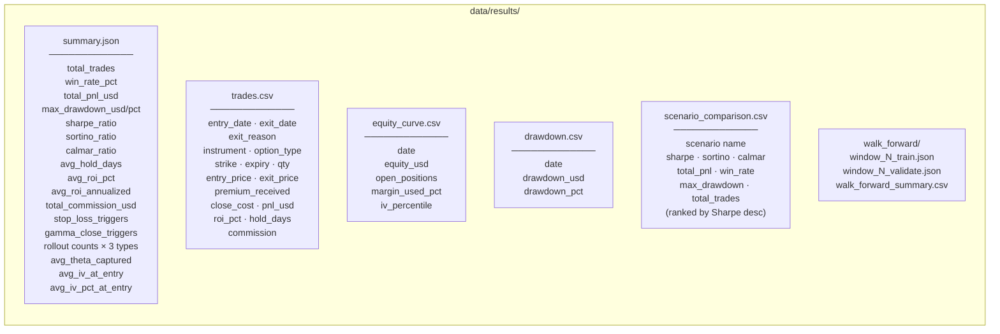
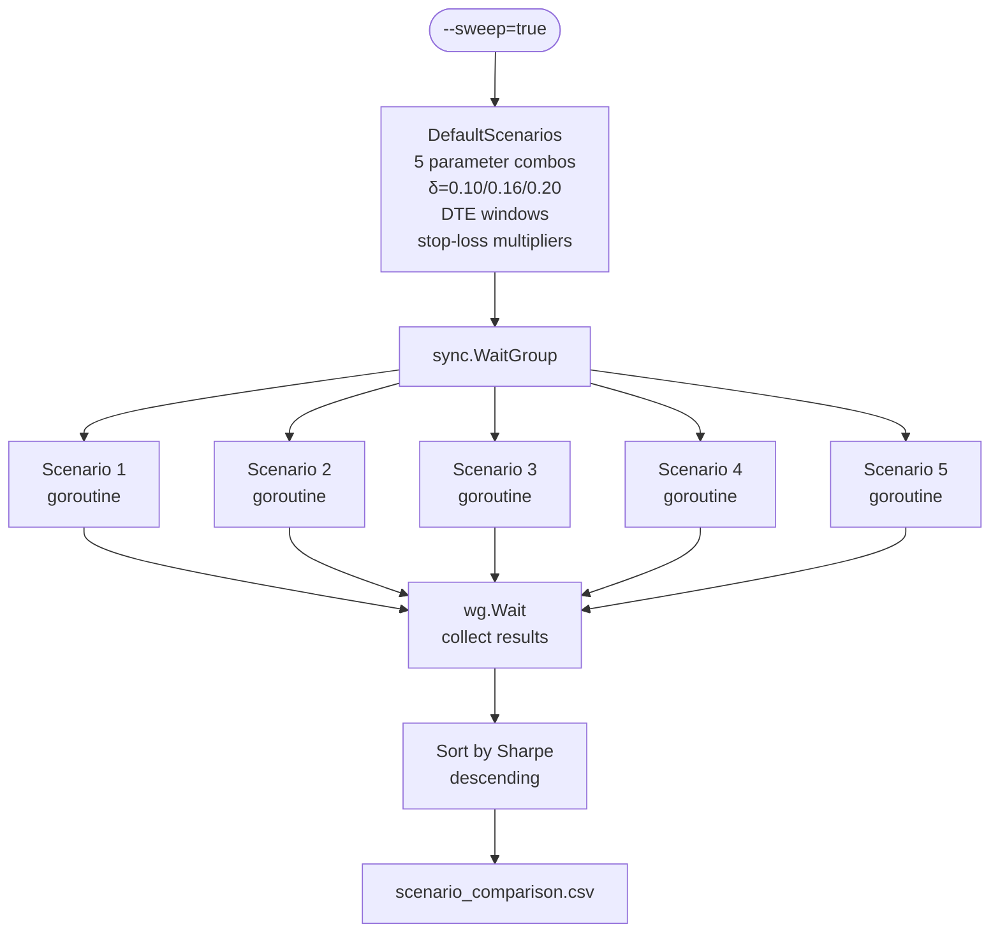
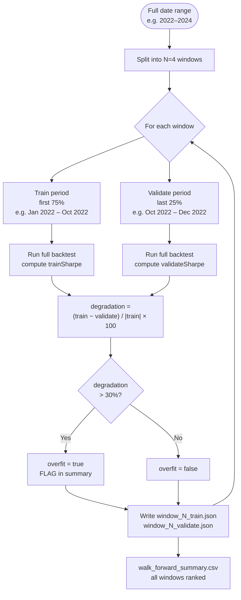
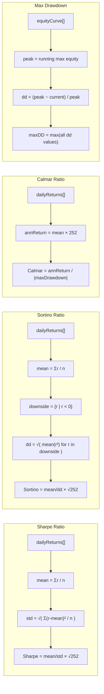

## Backtest Simulation Loop

```mermaid
flowchart TD
    A([--mode=backtest\n--from --to]) --> B[NewHistoricalFeed\nCSV load + sort\nby date·instrument]
    B --> C[NewSimExecutor\nstartEquity=100000]
    C --> D[NewEngine\nstate·gamma·margin\ndvol tracker]
    D --> E[engine.Run]

    subgraph LOOP["Daily Simulation Loop"]
        E --> F[Group ticks by\ntrading day]
        F --> G{For each day}
        G --> H[exec.UpdateTick\nfor all instruments\n→ process pending limits]
        H --> I[dvol.Push\nIV percentile update]
        I --> J[Update open position\nMid + Greeks]
        J --> K[gamma.PushPrice\nnetGamma check]
        K --> L{Gamma action?}
        L -->|"Close puts/calls"| M[handleGamma\nmarket close + record trade]
        L -->|"None"| N[For each position:\nEvaluateLeg]
        M --> N
        N --> O{Decision}
        O -->|"Action"| P[handleRollout\nclose + reopen]
        O -->|"None"| Q[maybeOpenStrangles\nif slot available]
        P --> Q
        Q --> R[Snapshot equity\ncalculate drawdown\nrecord PortfolioSnapshot]
        R --> G
    end

    E --> S[buildSummary\naggregate all metrics]
    S --> T[ResultWriter\nWriteSummary\nWriteTrades\nWriteEquityCurve\nWriteDrawdown]
```

## SimExecutor — Fill Models

```mermaid
flowchart TD
    A([Submit order]) --> B{OrderType?}
    B -->|"Market"| C{Direction?}
    C -->|"Buy"| D["fillPrice =\nmid + mid × slippage_pct"]
    C -->|"Sell"| E["fillPrice =\nmid − mid × slippage_pct"]
    D --> F[Deduct commission\ncommission_per_contract × qty\nequity -= commission]
    E --> F
    F --> G([Fill returned immediately])

    B -->|"Limit\nlimitFillRule=next_tick"| H[Add to\npendingLimits list]
    H --> I([Provisional Fill\nreturned at limitPrice])
    I --> J[On next tick\nprocessPendingLimits]
    J --> K{Buy: mid ≤ limit\nSell: mid ≥ limit\nOR 24h elapsed?}
    K -->|"Yes — filled"| L[Deduct commission]
    K -->|"No"| J

    B -->|"Limit\nlimitFillRule=immediate"| M["fillPrice = limitPrice\nfill immediately"]
    M --> F
```

## Results Output Structure

```mermaid
flowchart LR
    subgraph OUTPUTS["data/results/"]
        A["summary.json\n─────────────\ntotal_trades\nwin_rate_pct\ntotal_pnl_usd\nmax_drawdown_usd/pct\nsharpe_ratio\nsortino_ratio\ncalmar_ratio\navg_hold_days\navg_roi_pct\navg_roi_annualized\ntotal_commission_usd\nstop_loss_triggers\ngamma_close_triggers\nrollout counts × 3 types\navg_theta_captured\navg_iv_at_entry\navg_iv_pct_at_entry"]

        B["trades.csv\n─────────────\nentry_date · exit_date\nexit_reason\ninstrument · option_type\nstrike · expiry · qty\nentry_price · exit_price\npremium_received\nclose_cost · pnl_usd\nroi_pct · hold_days\ncommission"]

        C["equity_curve.csv\n─────────────\ndate\nequity_usd\nopen_positions\nmargin_used_pct\niv_percentile"]

        D["drawdown.csv\n─────────────\ndate\ndrawdown_usd\ndrawdown_pct"]

        E["scenario_comparison.csv\n─────────────\nscenario name\nsharpe · sortino · calmar\ntotal_pnl · win_rate\nmax_drawdown · total_trades\n(ranked by Sharpe desc)"]

        F["walk_forward/\nwindow_N_train.json\nwindow_N_validate.json\nwalk_forward_summary.csv"]
    end
```

## Scenario Sweep — Parallel Execution

```mermaid
flowchart TD
    A([--sweep=true]) --> B[DefaultScenarios\n5 parameter combos\nδ=0.10/0.16/0.20\nDTE windows\nstop-loss multipliers]
    B --> C[sync.WaitGroup]
    C --> D1[Scenario 1\ngoroutine]
    C --> D2[Scenario 2\ngoroutine]
    C --> D3[Scenario 3\ngoroutine]
    C --> D4[Scenario 4\ngoroutine]
    C --> D5[Scenario 5\ngoroutine]
    D1 & D2 & D3 & D4 & D5 --> E[wg.Wait\ncollect results]
    E --> F[Sort by Sharpe\ndescending]
    F --> G[scenario_comparison.csv]
```

## Walk-Forward Validation

```mermaid
flowchart TD
    A([Full date range\ne.g. 2022–2024]) --> B[Split into N=4 windows]
    B --> C{For each window}
    C --> D["Train period\nfirst 75%\ne.g. Jan 2022 – Oct 2022"]
    C --> E["Validate period\nlast 25%\ne.g. Oct 2022 – Dec 2022"]
    D --> F[Run full backtest\ncompute trainSharpe]
    E --> G[Run full backtest\ncompute validateSharpe]
    F & G --> H["degradation =\n(train − validate) / |train| × 100"]
    H --> I{degradation\n> 30%?}
    I -->|"Yes"| J[overfit = true\nFLAG in summary]
    I -->|"No"| K[overfit = false]
    J & K --> L[Write window_N_train.json\nwindow_N_validate.json]
    L --> C
    L --> M[walk_forward_summary.csv\nall windows ranked]
```

## Metrics Formulas

```mermaid
flowchart LR
    subgraph SHARPE["Sharpe Ratio"]
        A["dailyReturns[]"] --> B["mean = Σr / n"]
        B --> C["std = √( Σ(r-mean)² / n )"]
        C --> D["Sharpe = mean/std × √252"]
    end
    subgraph SORTINO["Sortino Ratio"]
        E["dailyReturns[]"] --> F["mean = Σr / n"]
        F --> G["downside = {r | r < 0}"]
        G --> H["dd = √( mean(r²) for r in downside )"]
        H --> I["Sortino = mean/dd × √252"]
    end
    subgraph CALMAR["Calmar Ratio"]
        J["dailyReturns[]"] --> K["annReturn = mean × 252"]
        K --> L["Calmar = annReturn / |maxDrawdown|"]
    end
    subgraph DRAWDOWN["Max Drawdown"]
        M["equityCurve[]"] --> N["peak = running max equity"]
        N --> O["dd = (peak − current) / peak"]
        O --> P["maxDD = max(all dd values)"]
    end
```
