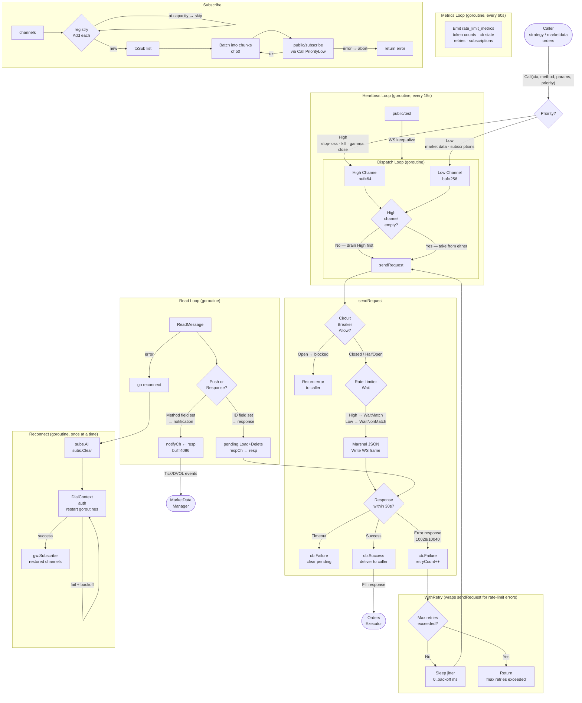
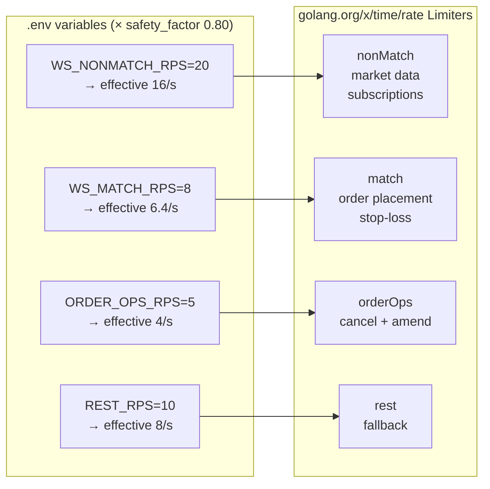
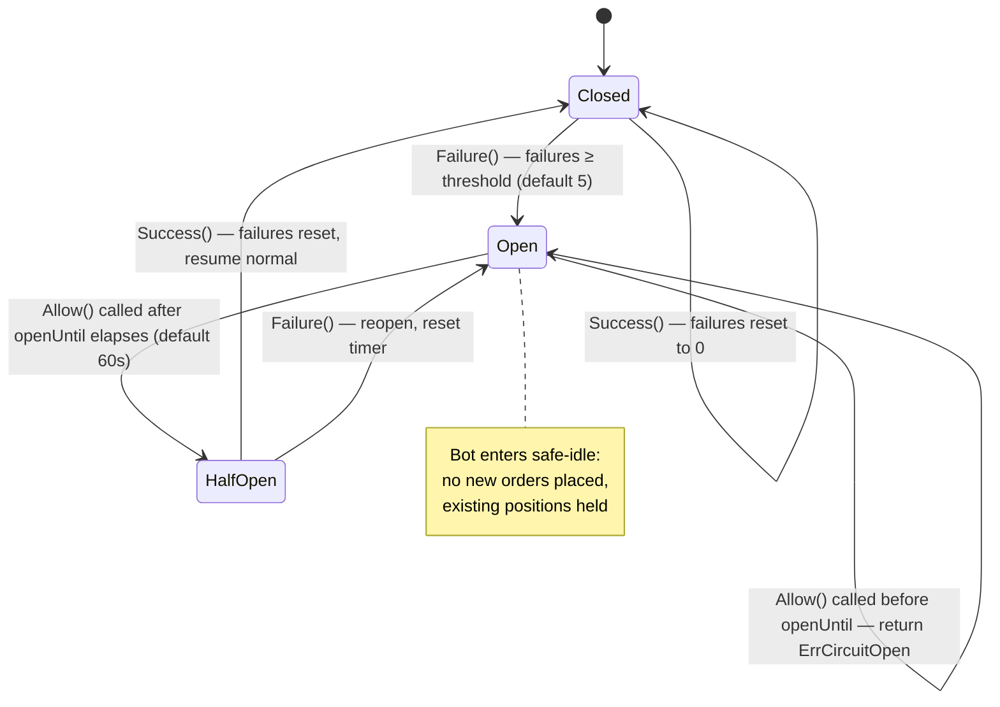

## Gateway Process Flow

```mermaid
flowchart TD
    A([Caller\nstrategy / marketdata\norders]) -->|"Call(ctx, method, params, priority)"| B{Priority?}
    B -->|"High\nstop-loss · kill · gamma close"| C[High Channel\nbuf=64]
    B -->|"Low\nmarket data · subscriptions"| D[Low Channel\nbuf=256]

    subgraph DISPATCH["Dispatch Loop (goroutine)"]
        E{High\nchannel\nempty?}
        C --> E
        D --> E
        E -->|"No — drain High first"| F[sendRequest]
        E -->|"Yes — take from either"| F
    end

    subgraph SEND["sendRequest"]
        F --> G{Circuit\nBreaker\nAllow?}
        G -->|"Open → blocked"| H[Return error\nto caller]
        G -->|"Closed / HalfOpen"| I{Rate Limiter\nWait}
        I -->|"High → WaitMatch\nLow → WaitNonMatch"| J[Marshal JSON\nWrite WS frame]
        J --> K{Response\nwithin 30s?}
        K -->|"Timeout"| L[cb.Failure\nclear pending]
        K -->|"Error response\n10028/10040"| M[cb.Failure\nretryCount++]
        K -->|"Success"| N[cb.Success\ndeliver to caller]
    end

    subgraph RETRY["WithRetry (wraps sendRequest for rate-limit errors)"]
        M --> O{Max retries\nexceeded?}
        O -->|"No"| P[Sleep jitter\n0..backoff ms]
        P --> F
        O -->|"Yes"| Q[Return\n'max retries exceeded']
    end

    subgraph READ["Read Loop (goroutine)"]
        R[ReadMessage] --> S{Push or\nResponse?}
        S -->|"Method field set\n→ notification"| T[notifyCh ← resp\nbuf=4096]
        S -->|"ID field set\n→ response"| U[pending.Load+Delete\nrespCh ← resp]
        U --> K
        R -->|"error"| V[go reconnect]
    end

    subgraph RECONNECT["Reconnect (goroutine, once at a time)"]
        V --> W[subs.All\nsubs.Clear]
        W --> X[DialContext\nauth\nrestart goroutines]
        X -->|"success"| Y[gw.Subscribe\nrestored channels]
        X -->|"fail + backoff"| X
    end

    subgraph HEARTBEAT["Heartbeat Loop (goroutine, every 15s)"]
        Z[public/test] -->|"WS keep-alive"| DISPATCH
    end

    subgraph METRICS["Metrics Loop (goroutine, every 60s)"]
        AA[Emit rate_limit_metrics\ntoken counts · cb state\nretries · subscriptions]
    end

    subgraph SUBS["Subscribe"]
        BB[channels] --> CC{registry\nAdd each}
        CC -->|"duplicate → skip"| CC
        CC -->|"at capacity → skip"| CC
        CC -->|"new"| DD[toSub list]
        DD --> EE[Batch into chunks\nof 50]
        EE --> FF[public/subscribe\nvia Call PriorityLow]
        FF -->|"error → abort"| GG[return error]
        FF -->|"ok"| EE
    end

    T -->|"Tick/DVOL events"| HH([MarketData\nManager])
    N -->|"Fill response"| II([Orders\nExecutor])
```

## Rate Limiter — Token Bucket Scopes

```mermaid
graph LR
    subgraph ENV[".env variables (× safety_factor 0.80)"]
        E1["WS_NONMATCH_RPS=20\n→ effective 16/s"]
        E2["WS_MATCH_RPS=8\n→ effective 6.4/s"]
        E3["ORDER_OPS_RPS=5\n→ effective 4/s"]
        E4["REST_RPS=10\n→ effective 8/s"]
    end
    subgraph BUCKETS["golang.org/x/time/rate Limiters"]
        B1["nonMatch\nmarket data\nsubscriptions"]
        B2["match\norder placement\nstop-loss"]
        B3["orderOps\ncancel + amend"]
        B4["rest\nfallback"]
    end
    E1 --> B1
    E2 --> B2
    E3 --> B3
    E4 --> B4
```

## Circuit Breaker — State Machine

```mermaid
stateDiagram-v2
    [*] --> Closed

    Closed --> Closed : Success() — failures reset to 0
    Closed --> Open : Failure() — failures ≥ threshold (default 5)

    Open --> Open : Allow() called before openUntil — return ErrCircuitOpen
    Open --> HalfOpen : Allow() called after openUntil elapses (default 60s)

    HalfOpen --> Closed : Success() — failures reset, resume normal
    HalfOpen --> Open : Failure() — reopen, reset timer

    note right of Open
        Bot enters safe-idle:
        no new orders placed,
        existing positions held
    end note
```
