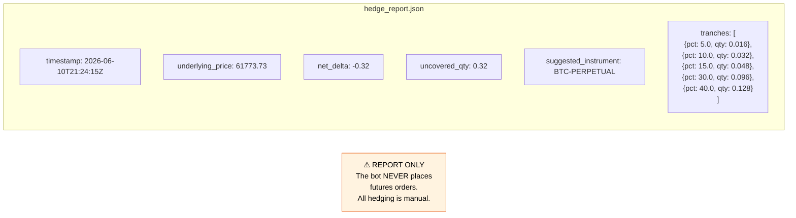

## Hedge Reporter Process Flow

```mermaid
flowchart TD
    A([Each tick where\nposition state changes]) --> B[strategy calls\nhedgeRpt.MaybeReport\nnetDelta · underlyingPrice\nsuggestedInst]

    B --> C{lastDelta == 0\nor first report?}
    C -->|"Yes — always emit"| E
    C -->|"No"| D{change =\n|netDelta − lastDelta|\n÷ |lastDelta|\n> threshold\ndefault 5%?}
    D -->|"No → skip"| Z([no output])
    D -->|"Yes"| E[Update lastDelta]

    E --> F[uncovered = |netDelta|]
    F --> G["Split into 5 tranches\n5% → 0.05 × uncovered\n10% → 0.10 × uncovered\n15% → 0.15 × uncovered\n30% → 0.30 × uncovered\n40% → 0.40 × uncovered"]
    G --> H[Build Report struct\ntimestamp · underlyingPrice\nnetDelta · uncoveredQty\nsuggestedInstrument\ntranches]
    H --> I[json.MarshalIndent\nwrite hedge_report.json\noverwrite previous]
    H --> J[slog.Info hedge_report\nstructured log to bot.log]

    style Z fill:#f5f5f5,stroke:#9e9e9e
```

## Hedge Report Output Structure


