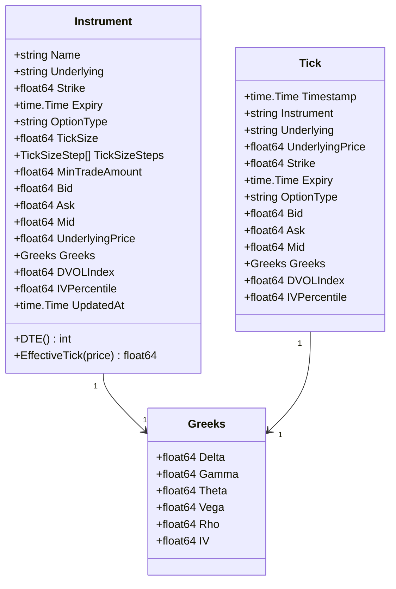
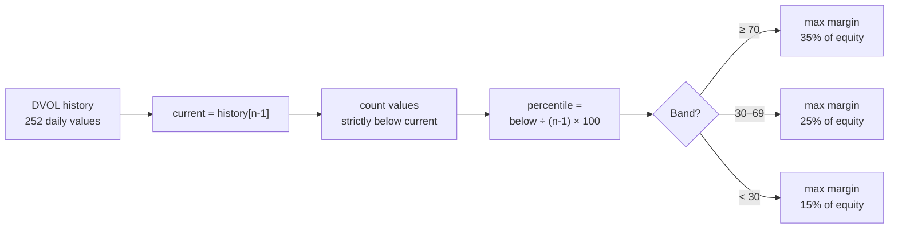

## MarketData Process Flow

```mermaid
flowchart TD
    subgraph STARTUP["Start() — called once at bot init"]
        A[public/get_instruments\ncurrency=BTC kind=option] --> B[Parse 1040+ instruments\nname·strike·expiry·type\ntickSize·minTradeAmount]
        B --> C[selectRelevantExpiries\n— see detail below —]
        C --> D{For each instrument\nin relevant expiries?}
        D -->|"Yes"| E[Add ticker.INST.100ms\nto channels list]
        D -->|"No → skip"| D
        E --> F[Add deribit_volatility_index\n.BTC_usd.1d]
        F --> G[gw.Subscribe\nbatches of 50\n~200-600 channels\nvs 1041 before fix]
        G --> H[go processNotifications]
    end

    subgraph RELEVANT["selectRelevantExpiries()"]
        I[For each targetDTE\n15·20·30·45] --> J{Find expiry\nin window\n±maxDTEDeviation days}
        J -->|"Found"| K[Add to relevant set]
        J -->|"Not found → skip"| I
        K --> L[Sort all future expiries\nasc by DTE]
        L --> M[Add next 3 expiries\nbeyond max targetDTE\nfor rollout support]
        M --> N([relevant expiries map\ntime.Time → struct{}])
    end

    subgraph NOTIFICATIONS["processNotifications() — goroutine"]
        O[gw.Notifications channel] --> P{channel prefix?}
        P -->|"deribit_volatility_index.*"| Q[dvol.Push(volatility)\nrolling 252-day history]
        P -->|"ticker.*"| R[handleTicker]
        P -->|"other → ignore"| O
    end

    subgraph TICKER["handleTicker()"]
        R --> S[Unmarshal\nbid·ask·markPrice\nunderlyingPrice\ngreeks{δγθVρ}\nmarkIV]
        S --> T{instrument\nin cache?}
        T -->|"No → ignore"| O
        T -->|"Yes"| U[Update cache\nbid·ask\nmid = bid+ask/2\nunderlyingPrice\ngreeks\nIV = markIV/100\ndvolIndex\nivPercentile\nupdatedAt]
        U --> V[Emit Tick to tickCh\nbuf=1024]
        V --> W([Strategy\nonTick handler])
    end

    subgraph DVOL["DVOLTracker — rolling percentile"]
        Q --> X[Append to history\ntrim to window size]
        X --> Y[Percentile =\n#values below current\n÷ window-1 × 100]
        Y --> Z([ivPercentile\n0–100])
    end
```

## Instrument Data Model



## IV Percentile Calculation


