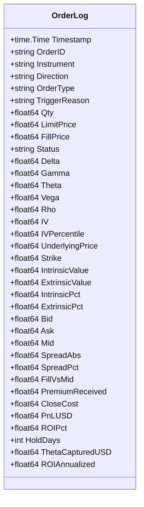
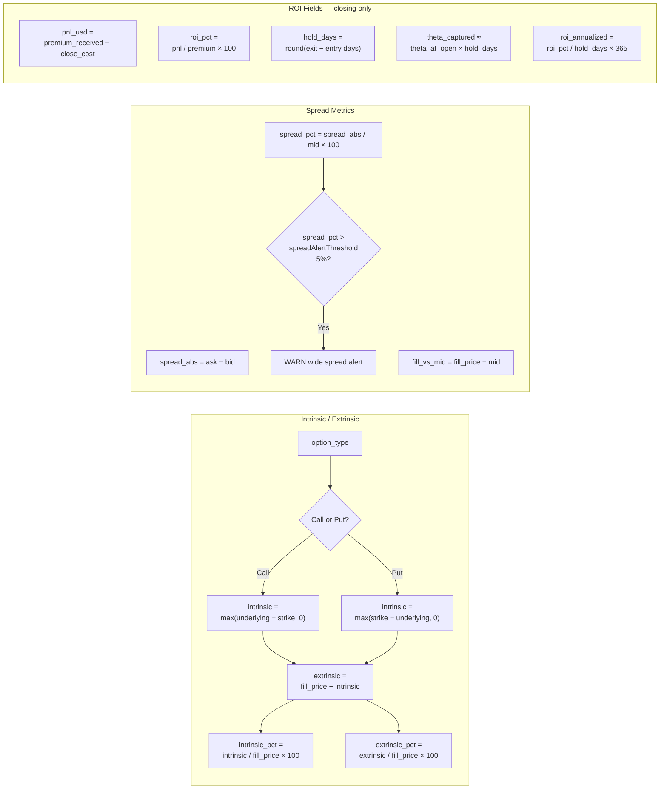
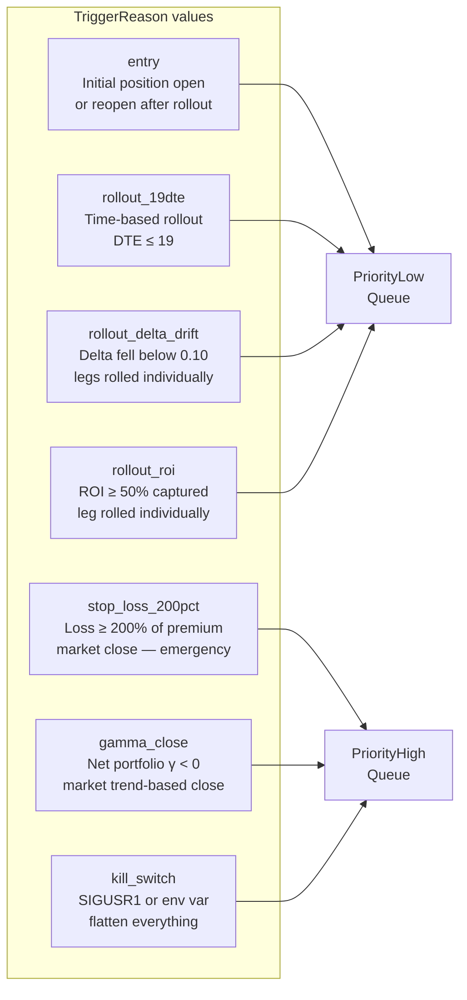

## Orders Process Flow

```mermaid
flowchart TD
    subgraph EXECUTOR["Executor — live order placement"]
        A([Strategy\nOrder request]) --> B{Direction?}
        B -->|"Sell"| C[private/sell\nvia Gateway.Call]
        B -->|"Buy"| D[private/buy\nvia Gateway.Call]
        C --> E{TriggerReason\nstop-loss?\nkill-switch?\ngamma-close?}
        D --> E
        E -->|"Yes → PriorityHigh"| F[Priority Queue\nHigh channel]
        E -->|"No → PriorityLow"| G[Priority Queue\nLow channel]
        F --> H[Deribit API\nreturns order_id\navg_price\nfilled_amount]
        G --> H
        H --> I[Fill{orderID\nfillPrice\nqty\ntimestamp}]
    end

    subgraph STATE["StateManager — in-memory position tracking"]
        I --> J[AddPosition\nor update existing]
        J --> K[(positions map\nID → Position)]
        J --> L[(strangles map\nID → Strangle)]
        K --> M[NetGamma()\n= Σ γ×qty]
        K --> N[TotalNetDelta()\n= Σ δ×qty]
        K --> O[TotalMarginUsed()\n= Σ mid×qty]
    end

    subgraph LOGGER["OrderLogger — JSON audit trail"]
        I --> P[buildRecord\nFill + Position + Greeks]
        P --> Q[Compute derived fields\nintrinsic/extrinsic\nspread metrics]
        Q --> R{Closing\ntransaction?}
        R -->|"Yes"| S[Compute ROI fields\npnl · roi_pct · hold_days\ntheta_captured · roi_ann]
        R -->|"No"| T[Skip ROI fields\nomitempty → absent]
        S --> U[JSON marshal\nAppend to orders.log]
        T --> U
    end
```

## OrderLog Data Model



## Derived Field Calculations



## Trigger Reason Reference


