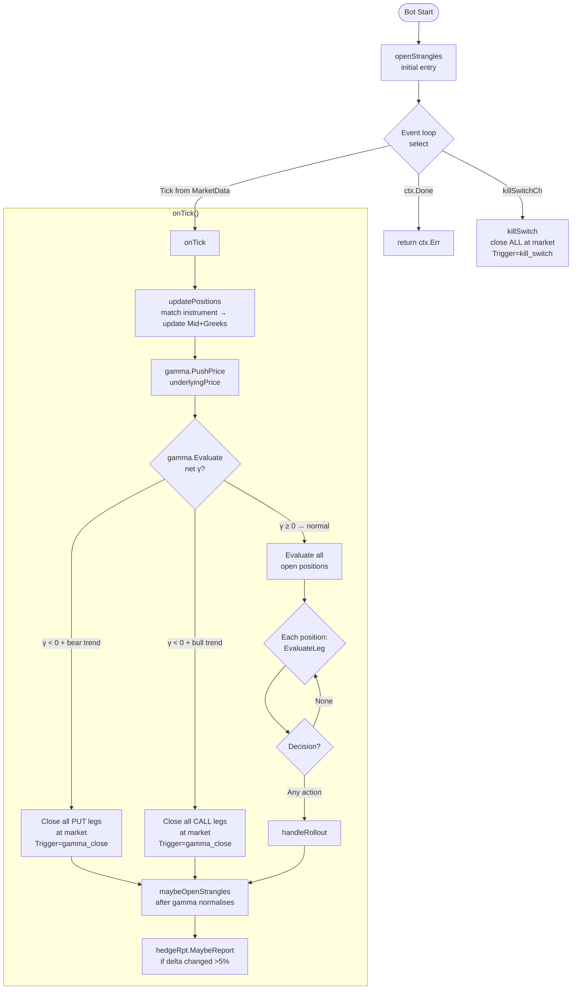
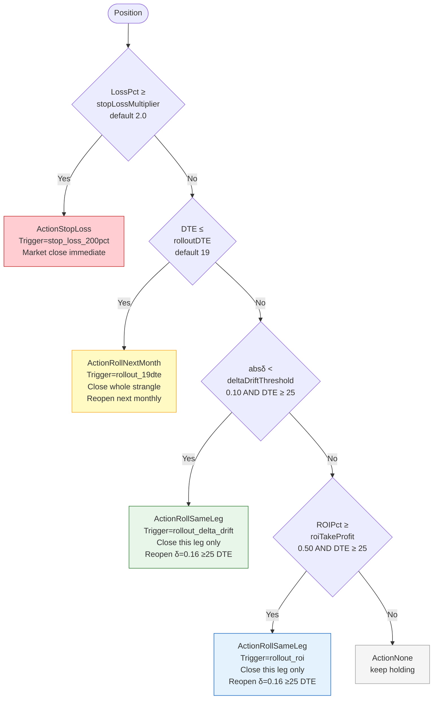
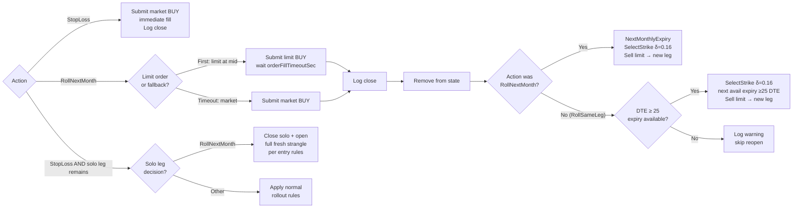
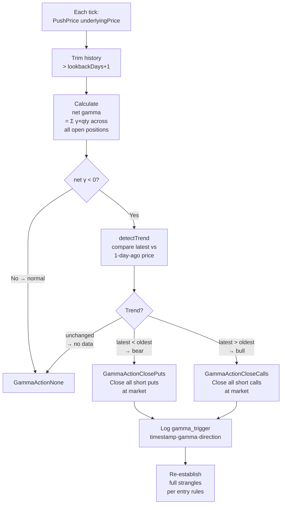
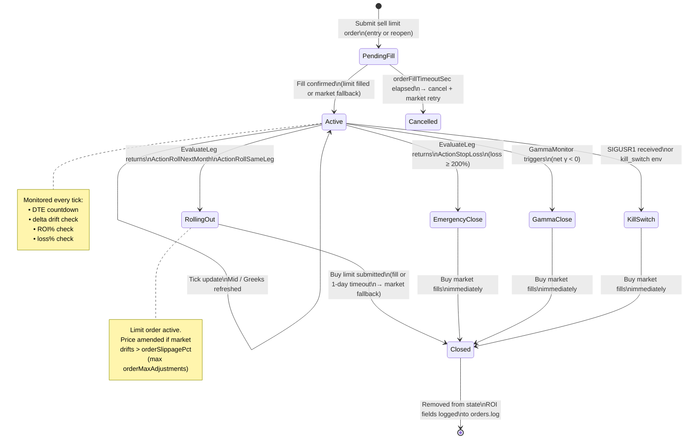
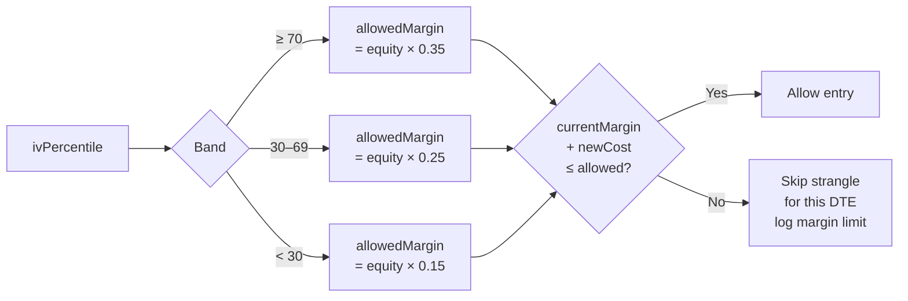

## Main Event Loop



## Rollout Decision — Priority Order



## Rollout Execution Flow



## Entry Logic — Strike & Expiry Selection

```mermaid
flowchart TD
    A([openStrangles\ncalled at startup\n+ maybeOpen each tick]) --> B[AllInstruments\nfrom MarketData]
    B --> C[AccountEquity\nfrom Executor]
    C --> D[IVPercentile\nfrom DVOLTracker]
    D --> E{For each\ntargetDTE\n15·20·30·45}

    E --> F[SelectExpiry\nfind nearest expiry in\ntargetDTE ± maxDTEDeviation\nprefer lower DTE]
    F --> G{Expiry\nfound?}
    G -->|"No"| H[Log skip\nnext targetDTE]
    G -->|"Yes"| I[SelectStrike CALL\nOTM filter absδ < 0.5\nMid > 0\nSort by ‖δ‖ − 0.16‖\npick closest]
    I --> J[SelectStrike PUT\nsame logic\nneg delta]
    J --> K[quantizeAmount\nbudget/numDTEs\nstep = max(cfg.MinTA,\ninst.MinTradeAmount)]
    K --> L{marginGuard\nWithinLimit?}
    L -->|"No → skip"| H
    L -->|"Yes"| M[openStrangle\nexchStep re-quantize\nSubmit sell call limit\nSubmit sell put limit]
    M --> N[Pending Strangle\nawait fills]
    N --> O{Both legs\nfilled?}
    O -->|"Yes"| P[activateStrangle\nAdd to State\nLog open both legs]
    O -->|"Timeout"| Q[Cancel unfilled leg\ntry market fill]
```

## Gamma Monitor



## Position Lifecycle — State Diagram



## Margin Guard — IV Risk Model


